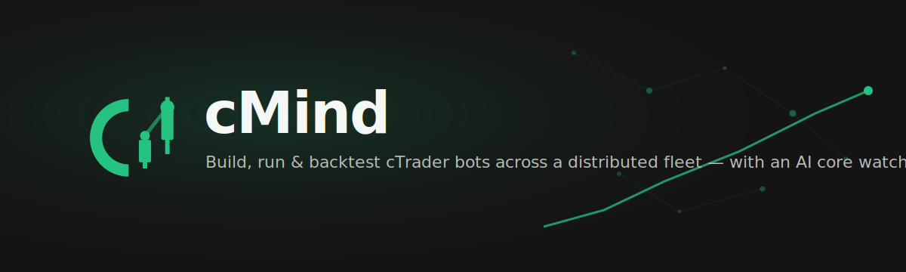
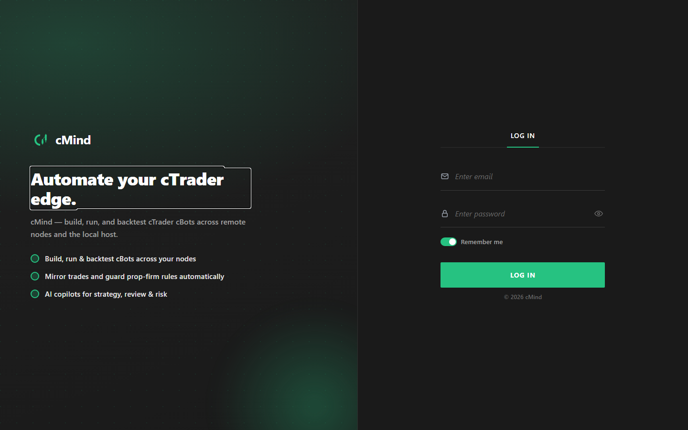
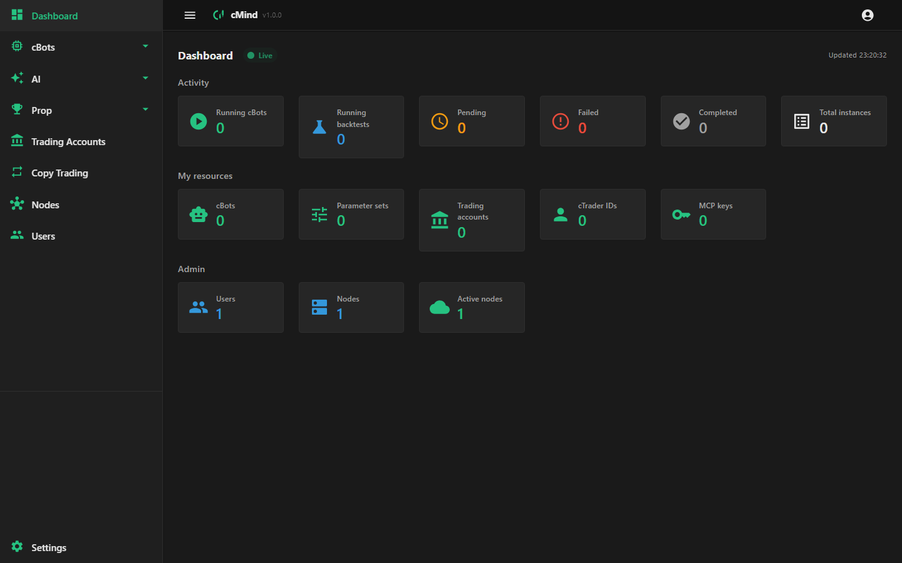
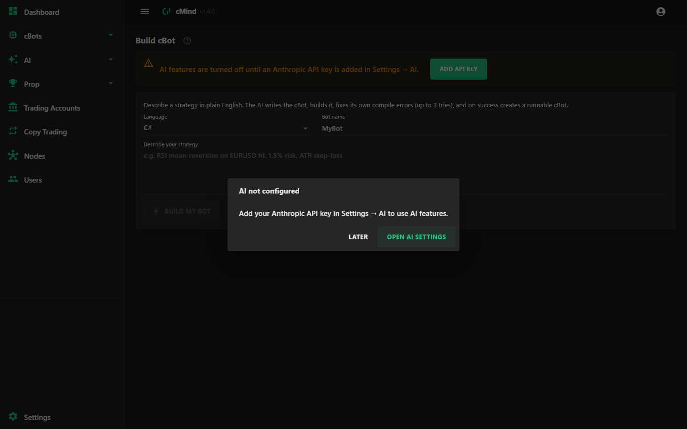
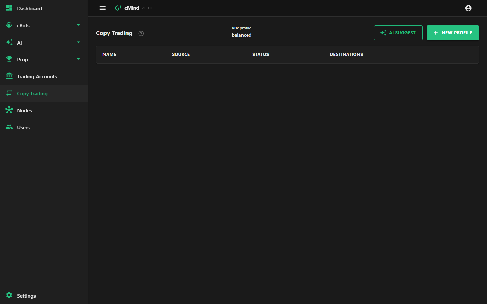
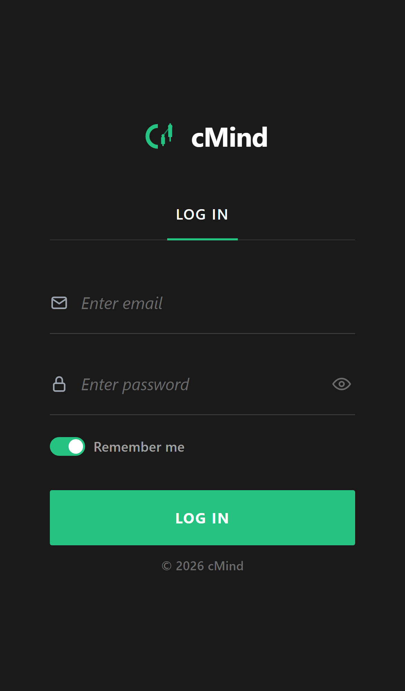
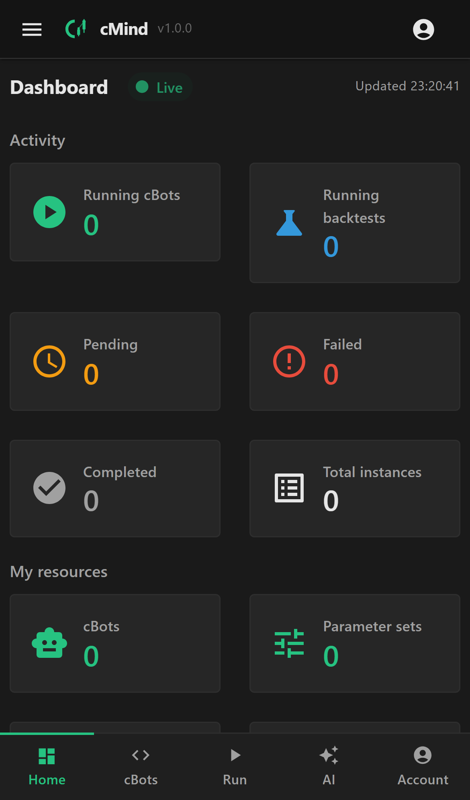

<p align="center">
  
</p>

<h1 align="center">cMind</h1>

<p align="center">
  <b>The self-hostable trading-operations platform for cTrader.</b><br/>
  Build · backtest · run · copy — across a distributed node fleet, with an AI core watching the risk.
</p>

<p align="center">
  <a href="https://github.com/amusleh-spotware-com/cmind/actions/workflows/ci.yml"></a>
  <a href="https://github.com/amusleh-spotware-com/cmind/actions/workflows/codeql.yml"></a>
  <a href="LICENSE"></a>
  
  
  
  
  <a href="AGENTS.md"></a>
  <a href="CONTRIBUTING.md"></a>
</p>

<p align="center">
  <a href="#-features">Features</a> ·
  <a href="#-screenshots">Screenshots</a> ·
  <a href="#-who-its-for">Who it's for</a> ·
  <a href="#-quick-start">Quick start</a> ·
  <a href="#-tech">Tech</a> ·
  <a href="#contributing--wed-love-your-help-">Contributing</a>
</p>

---

## 📸 Screenshots

<table>
  <tr>
    <td width="50%"></td>
    <td width="50%"></td>
  </tr>
  <tr>
    <td align="center"><b>Branded split-screen login</b></td>
    <td align="center"><b>Live operations dashboard</b></td>
  </tr>
  <tr>
    <td width="50%"></td>
    <td width="50%"></td>
  </tr>
  <tr>
    <td align="center"><b>AI — build a cBot from a prompt</b></td>
    <td align="center"><b>Copy trading across accounts</b></td>
  </tr>
</table>

<p align="center">
  <i>Mobile-first &amp; installable —</i><br/>
  
  &nbsp;&nbsp;
  
</p>

---

## ✨ Features

| | |
|---|---|
| 🤖 **AI that does the work** | Plain-English prompt → runnable cBot via a generate → build → self-repair loop. Code review, strategy debate, market sentiment, exposure check, portfolio digest, tune advisor, and a background **risk guard** that can auto-stop bots. |
| 🔁 **Copy trading, money-grade** | Mirror one master onto many accounts across brokers &amp; cTrader IDs — per-destination sizing, direction, symbols, order types (market / range / limit / stop / stop-limit), SL/TP, expiry, exact slippage. Reconciles through drops, rejections &amp; token rotation without duplicating trades. |
| 🧠 **Build &amp; backtest cBots** | In-browser Monaco IDE (C# **and** Python), sandboxed `dotnet build` in throwaway containers, parameter sets, live logs and equity curves streamed back. |
| 🛰️ **Distributed fleet** | Runs &amp; backtests are scheduled onto the least-loaded node; agents self-register and heartbeat; a self-healing lease reclaims a dead node's work automatically. |
| 🏆 **Prop-firm tooling** | Live challenge tracking (drawdown / daily-loss / target / min-days), an AI exposure guardian, and auto-flatten on breach. |
| 📱 **Mobile-first &amp; installable** | Fully responsive UI you **install as an app** (PWA) — bottom-nav, card layouts, offline shell, add-to-home-screen. |
| 🎨 **White-label** | Every deployment re-skins name, logo, colours, and icons from config — resellers ship it as their own. |
| 🔌 **MCP server** | Exposes tools over HTTP+SSE so external AI clients can drive cMind. |
| 🔒 **Hardened &amp; yours to run** | Argon2id, encrypted key ring, per-node signed JWTs, rate limiting, structured logs + OpenTelemetry. Self-host on Docker, Kubernetes, Azure, or AWS. |

## 🎯 Who it's for

- **Algorithmic traders &amp; quants** who write cBots and want to run, backtest, and optimize them at scale — not babysit a single terminal.
- **Prop-firm operators &amp; trading desks** mirroring strategies across many accounts with rule-guards and a full audit trail.
- **Developers &amp; resellers** who want a hardened, white-labelable, self-hosted trading-ops console — with an MCP + API surface to build on.

## 🗂️ What's inside

| Capability | Docs |
|------------|------|
| Copy trading (mirroring, order types, SL/TP, slippage, sync/desync) | [features/copy-trading.md](docs/features/copy-trading.md) |
| Open API token lifecycle (single valid token per cID, in-place rotation) | [features/token-lifecycle.md](docs/features/token-lifecycle.md) |
| AI assistant, agent, risk guard, alerts, prop-guard | [features/ai.md](docs/features/ai.md) |
| Build &amp; backtest cBots (in-browser Monaco IDE, C# + Python) | [features/build-and-backtest.md](docs/features/build-and-backtest.md) |
| Node fleet &amp; horizontal scaling | [operations/node-discovery.md](docs/operations/node-discovery.md) · [deployment/scaling.md](docs/deployment/scaling.md) |
| MCP server (HTTP + SSE tools for AI clients) | [features/mcp.md](docs/features/mcp.md) |
| Installable app &amp; design system (mobile-first, PWA, white-label) | [features/pwa.md](docs/features/pwa.md) · [ui-guidelines.md](docs/ui-guidelines.md) |
| Deployment (Compose, K8s/Helm, Azure, AWS) | [deployment/](docs/deployment/) |
| Testing &amp; dev credentials | [testing/](docs/testing/) · [testing/dev-credentials.md](docs/testing/dev-credentials.md) |

## 🚀 Quick start

```bash
dotnet restore
dotnet run --project src/AppHost      # full stack via .NET Aspire (Postgres, Web, MCP)
```

Open the Web URL from the Aspire dashboard. For a Web-only run, deployment, and step-by-step setup,
see **[docs/deployment/local.md](docs/deployment/local.md)**.

> 💡 On a phone? Open the app in your browser and **Add to Home Screen** — it installs as a standalone app.

## 🛠️ Tech

.NET 10 · ASP.NET Core Minimal APIs · Blazor Server (SSR) + MudBlazor · mobile-first responsive UI +
installable PWA · white-label theming · EF Core 10 + PostgreSQL · .NET Aspire · Docker ·
gRPC/Protobuf (cTrader Open API) · Serilog + OpenTelemetry · MCP · Playwright E2E (mobile + desktop).
Architecture follows **strict Domain-Driven Design** — see [CLAUDE.md](CLAUDE.md) and
[docs/ui-guidelines.md](docs/ui-guidelines.md).

## Contributing — we'd love your help 💛

**cMind is built by and for cTrader traders, quants, and developers.** Every bug report, doc fix, and
PR makes it better — and you don't need to be a .NET expert to start. Traders who report precise
cTrader behavior are as valuable as the people writing aggregates.

- 🐛 [Report a bug](https://github.com/amusleh-spotware-com/cmind/issues/new?template=bug_report.yml)
  · 💡 [Request a feature](https://github.com/amusleh-spotware-com/cmind/issues/new?template=feature_request.yml)
  · 💬 [Ask in Discussions](https://github.com/amusleh-spotware-com/cmind/discussions)
- 🚀 **New here?** Start with a [good first issue](https://github.com/amusleh-spotware-com/cmind/labels/good%20first%20issue)
  or the [10-minute first contribution](CONTRIBUTING.md#your-first-contribution-in-10-minutes).
- 🤖 **AI-assisted contributions are welcome and encouraged** — the repo is agent-ready. See
  **[AGENTS.md](AGENTS.md)** and [Contributing with agentic AI](CONTRIBUTING.md#contributing-with-agentic-ai-).
- 📋 Full guide, PR/issue standards, and what we accept: **[CONTRIBUTING.md](CONTRIBUTING.md)**.

Every merged contributor is credited. Come build the platform you wish existed. → **[Start here](CONTRIBUTING.md)**

## 🔐 Security · License

- Report vulnerabilities per [SECURITY.md](SECURITY.md).
- MIT licensed — see [LICENSE](LICENSE). Built with [Claude Code](https://claude.com/claude-code).
