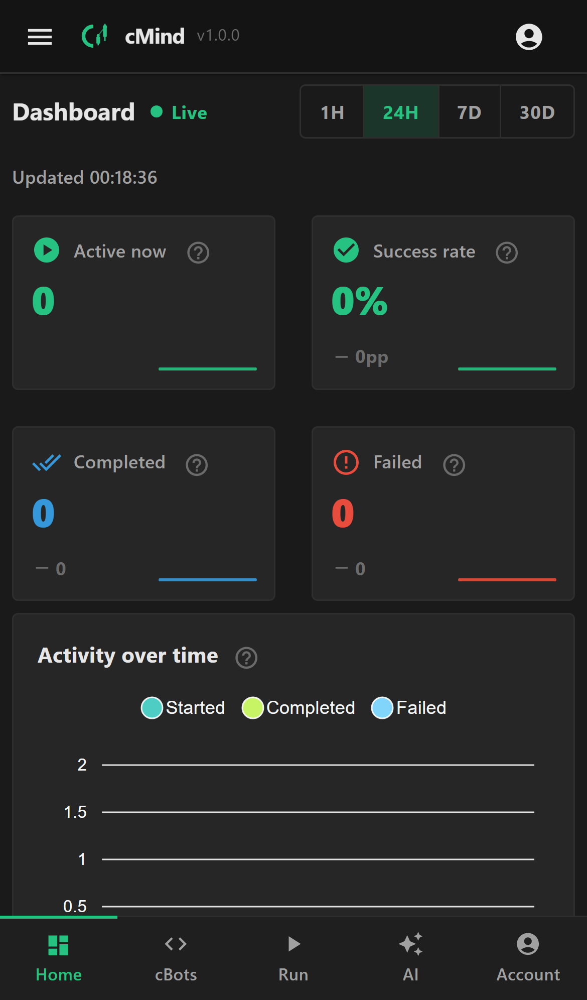
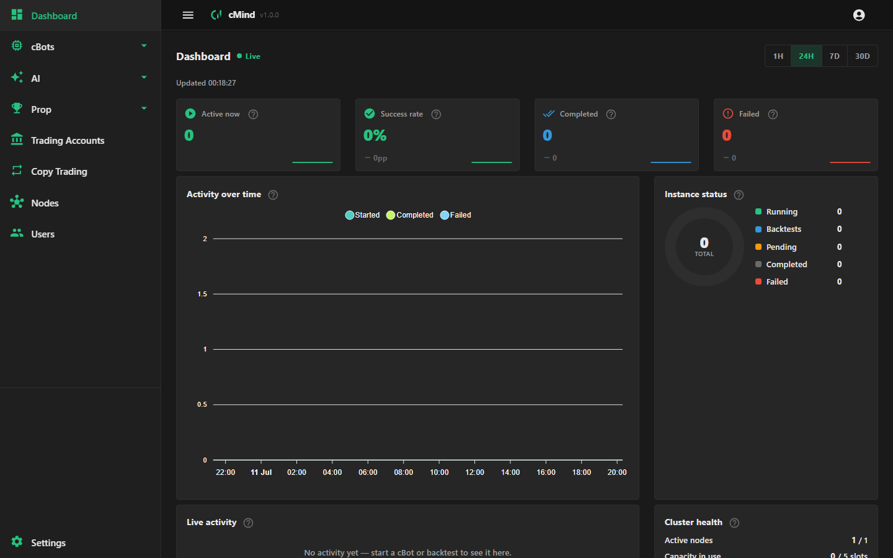

# cMind — Brand & Visual Design Brief

> For a Claude-powered (or human) designer producing **logo, app icon, favicon, and backgrounds**.
> This is the single source of truth for the visual identity. Everything must survive **white-labeling**
> (see [§8](#8-white-label-constraint-critical)) and work in a **dark-first, mobile-first, installable**
> product.

---

## 1. What cMind is (in one paragraph)

**cMind is a multi-tenant web platform that builds, runs, and backtests cTrader trading bots (cBots),
scheduled across a fleet of remote compute nodes, and mirrors live trades across accounts (copy
trading).** Traders write cBot code (C# / Python) in an in-browser Monaco IDE, compile it in sandboxed
Docker containers, launch live runs and historical backtests that get distributed to the least-loaded
node in the cluster, watch equity curves and logs stream back in real time, and let an AI layer
generate, review, and risk-guard their strategies. It is a **serious financial / algorithmic-trading
operations console** — not a consumer fintech toy.

### What it *does*, concretely
- **Authoring** — Monaco code editor, C#/Python cBot templates, parameter sets, sandboxed `dotnet build`.
- **Execution** — run & backtest instances dispatched across remote nodes + local host; live logs,
  equity curves, exit-code reconciliation.
- **Distributed fleet** — a scheduler picks nodes; agents self-register and heartbeat; leases reclaim
  on node death. This is *infrastructure*, and the brand should feel like it.
- **Copy trading** — mirror orders across cTrader accounts over the Open API, incl. failure/desync/
  token-rotation handling.
- **AI layer** — generate strategies, review code, analyze backtests, market sentiment, chart vision,
  a background "risk guard" that watches running bots.
- **Multi-tenant / white-label** — every deployment can be re-skinned by a reseller.

### Who uses it
Algorithmic traders, quant-leaning developers, and prop-firm / trading-desk operators. Technical,
detail-obsessed, money-on-the-line. They live in dark dashboards, charts, terminals, and IDEs.

---

## 2. Brand personality

Design to these adjectives, in priority order:

1. **Precise / engineered** — this software moves real money and orchestrates a compute cluster. Sharp,
   deliberate, grid-aligned. Not playful, not hand-drawn.
2. **Intelligent / "mind"** — the name is *cMind*. There is a cognitive/AI thread: strategy generation,
   risk reasoning, an autonomous agent. A subtle neural / synaptic / "thinking" motif is on-brand.
3. **Financial / market** — trading, candles, equity curves, upward momentum. Green = profit is baked
   into the default palette.
4. **Infrastructure / distributed** — nodes, clusters, orchestration. Networked, multi-point,
   connected structures read true.
5. **Modern / dark / premium** — a professional dark UI, neon-mint accent, high contrast. Think
   Linear / Vercel / a trading terminal — restrained, high-craft, zero clip-art.

**Avoid:** cartoon robots, literal brains with gears, dollar-sign clichés, stocky "up-arrow + bar
chart" logos, gradients-for-the-sake-of-it, light/pastel themes, playful rounded mascots, AI "glowing
orb" clichés.

---

## 3. The name & the mark

- Product name: **cMind** (lower-case `c`, capital `M`). The `c` nods to **cTrader** and **C#**; `Mind`
  is the intelligence/AI core.
- Wordmark should keep the `c` + `Mind` legible and distinct — the case pattern *is* the brand. Don't
  restyle to "CMind", "Cmind", or "C-Mind".
- Ideal mark: a **monogram/symbol that fuses `c` + a mind/node motif** and reads at 16px (favicon) and
  512px (splash) alike.

### Concept directions for the symbol (pick/blend, don't do all)
- **A** — The `c` drawn as an **open arc / node** with small connected nodes branching off it
  (cluster + neuron in one). The arc opening can subtly imply an upward candle/curve.
- **B** — A **`c` whose negative space forms an upward equity curve / candle**, mint on dark.
- **C** — A **synapse/network glyph** where the central node + radiating links compose a `c` silhouette.
- **D** — Monogram `cM` locked tight, the `M`'s valley reading as a market chart trough→peak.

Deliver the symbol so it works **standalone** (app icon) and **lock-up** (symbol + "cMind" wordmark,
horizontal and stacked).

---

## 4. Color palette (from the product's actual default theme)

These are the live white-label **defaults** (`Core/Constants/AppConstants.cs → BrandingDefaults`). The
brand art must look native against them, but must **not hard-bake** them (a reseller swaps them).

| Role | Hex | Use in art |
|------|------|-----------|
| **Primary / accent** (mint green) | `#26C281` | The hero brand color. Logo accent, glow, "profit". |
| Secondary (deep mint) | `#1FB97A` | Gradient partner to primary. |
| App bar / near-black | `#141414` | Darkest surface. |
| Background | `#1A1A1A` | Default canvas — **design the logo to sit on this**. |
| Surface | `#262626` | Cards / elevated panels. |
| Success | `#26C281` | (= primary) up / profit. |
| Error | `#E74C3C` | down / loss / stop. |
| Warning | `#F39C12` | caution. |
| Info | `#3498DB` | neutral info. |

**Palette guidance**
- Signature combo: **mint `#26C281` on near-black `#1A1A1A`** — high-contrast, terminal-grade, "money
  green in the dark".
- A mint→deep-mint gradient (`#26C281 → #1FB97A`) is allowed for depth; keep it subtle.
- Loss-red `#E74C3C` may appear *only* as a small tension accent (a down-candle, a divergent node) —
  never dominant.
- Provide a **monochrome** (single-mint and single-white) and a **pure-black / pure-white** version for
  stamping, invoices, and low-color contexts.

---

## 5. Logo — deliverables & rules

**Formats:** primary as **SVG** (vector, the app's default favicon is `favicon.svg`), plus PNG exports.

Deliver:
1. **Symbol only** (square-safe) — SVG + 512/256/128/64 px PNG.
2. **Horizontal lock-up** (symbol + wordmark) — SVG + PNG. For the top app bar / README hero.
3. **Stacked lock-up** (symbol over wordmark) — SVG + PNG. For splash / login hero.
4. **Monochrome** (mint, white, black) variants of symbol + lock-up.
5. **Wordmark only** — SVG.

**Rules**
- Must read on **`#1A1A1A` dark first**; also supply a version that survives on white and on the mint
  primary (for branded headers).
- Legible & balanced at **16px** (favicon) through **512px** (splash). Test the symbol at 16px — if the
  detail muddies, simplify.
- Clear-space = height of the symbol's core stroke on all sides. Define a min size (~20px).
- Flat / minimal-depth. One accent color + neutrals. No photographic textures, no bevels, no drop
  shadows baked in.

---

## 6. App icon / favicon / PWA icons (installable app)

cMind is a **PWA — add-to-home-screen installable**. The icon is a home-screen tile, so it needs a
**filled, contained** treatment (a bare thin glyph looks weak as an OS icon).

Deliver an **icon system** derived from the symbol:

| Asset | Size | Notes |
|-------|------|-------|
| `favicon.svg` | vector | Default favicon reference in code. Crisp at 16/32px. |
| `favicon-32.png`, `favicon-16.png` | 32, 16 | Fallbacks. |
| `apple-touch-icon.png` | 180×180 | iOS home screen (iOS ignores the manifest icon). |
| `icon-192.png` | 192×192 | PWA manifest. |
| `icon-512.png` | 512×512 | PWA manifest / splash. |
| `icon-512-maskable.png` | 512×512 | **Maskable** — keep the glyph inside the **safe zone** (center 80%, ~40px padding on 512) so Android's circle/squircle/rounded masks never clip it. Full-bleed background. |

**Icon treatment**
- A **filled dark tile** (`#141414`/`#1A1A1A`) with the **mint symbol** centered — or the inverse (mint
  tile, dark glyph) for a bolder home-screen presence. Provide both; recommend one.
- Optional very subtle radial mint glow behind the glyph for depth on the maskable/512.
- Corner radius: deliver **square** art; let the OS/manifest apply masking (esp. for maskable). For the
  Apple touch icon, ship square (iOS rounds it).

---

## 7. Backgrounds

Backgrounds appear behind the **login/hero**, the **PWA splash**, empty-states, and the **README hero**.
Design a small **family** so the app feels cohesive:

1. **Login / hero background** (desktop wide + mobile portrait)
   - Base: near-black `#1A1A1A`/`#141414`.
   - Motif: a **faint node/cluster network** or a **ghosted equity curve / candlestick grid**, mint at
     very low opacity (5–12%), drifting toward one corner. Should never fight the centered login card.
   - Optional single soft mint radial glow, off-center, as a light source.
   - Must have a **calm central/edge zone** where a form card or logo sits with full contrast.

2. **PWA splash background**
   - Solid `background_color` (`#1A1A1A`) with the **stacked logo centered**. Keep it dead simple —
     splash shows for a blink; no busy art.

3. **Empty-state / section backgrounds (subtle)**
   - Very low-contrast tiled/vector texture (dot-grid, faint node mesh, or contour lines) usable behind
     empty tables/dashboards. Tileable SVG preferred.

4. **README / marketing hero (optional, high-impact)**
   - A richer version of the login motif: dark canvas, mint network + a glowing upward equity curve,
     the cMind lock-up. This one may be more expressive since it's not behind live UI.

**Background rules**
- Dark-first, low-luminance — the UI content sits on top and must stay readable.
- Respect **safe areas** (mobile notch/home-indicator; the app uses `viewport-fit=cover`).
- Provide as **SVG** where vector-friendly (patterns, gradients) and **high-res PNG/WebP** where painterly.
- Keep motifs **abstract** — nodes, curves, candles, synapses — not literal illustrations.

---

## 8. White-label constraint (CRITICAL)

cMind is **multi-tenant white-label**: any deployment can override product name, colors, logo, favicon
via `App:Branding` (`BrandingOptions`). Design accordingly:

- The **default** identity (mint/dark, "cMind") is what you're crafting — make it excellent.
- But the **system** must degrade gracefully when a reseller swaps the accent color: prefer art where
  the **accent is a single swappable color** over a fixed multi-color illustration. A logo whose mint
  can become any hue (single-color symbol) is more valuable than a fixed-gradient mascot.
- Deliver the symbol as **currentColor-friendly SVG** (single fill) so it can be recolored per tenant,
  plus the polished full-color default.
- Backgrounds: keep the "brandable" element (the accent glow/motif) as a **separable color layer** so a
  tenant's primary can drive it.

---

## 9. Full deliverables checklist

- [ ] Logo symbol — SVG + PNG (512/256/128/64).
- [ ] Horizontal lock-up — SVG + PNG.
- [ ] Stacked lock-up — SVG + PNG.
- [ ] Wordmark — SVG.
- [ ] Monochrome (mint / white / black) — symbol + lock-up.
- [ ] Single-fill `currentColor` SVG of the symbol (for white-label recolor).
- [ ] `favicon.svg`, `favicon-32.png`, `favicon-16.png`.
- [ ] `apple-touch-icon.png` (180).
- [ ] `icon-192.png`, `icon-512.png`, `icon-512-maskable.png` (safe-zone respected).
- [ ] Login/hero background — desktop + mobile.
- [ ] PWA splash background.
- [ ] Subtle empty-state texture (tileable SVG).
- [ ] README/marketing hero (optional).
- [ ] Short usage note: clear-space, min-size, do/don't, which variant on which surface.

---

## 10. One-line prompt (paste to an image model)

> Minimal vector logo for **cMind**, a dark, premium algorithmic-trading operations platform that
> builds and runs cTrader bots across a distributed compute cluster with an AI core. A single-color
> **mint-green (`#26C281`)** symbol on **near-black (`#1A1A1A`)**: the lowercase letter **`c`** drawn as
> an open arc that doubles as a **network node with small connected nodes** and subtly implies an
> **upward equity curve**. Flat, precise, engineered, high-contrast, terminal-grade. No gradients-for-
> show, no 3D, no cartoon robot, no dollar signs, no brain-with-gears. Must read at 16px and 512px.

---

## 11. Screenshots of the app UI

*(Space reserved — add exported PNGs under `design/screenshots/` and reference them here.)*

The app is a **dark, mobile-first, installable** Blazor Server + MudBlazor dashboard. A mobile-first UI
overhaul is in flight (bottom-nav, drawer-closed-on-mobile, responsive tables→cards, redesigned login,
PWA install) — see `plans/ui-overhaul.md`.

Screenshots must be captured from a **live app boot** (there are none checked into the repo — the only
existing PNGs in `tmp-onboard/` are the *external* cTrader OAuth page, not cMind's own UI). To capture:

- Boot the app (`dotnet run --project src/Web`, or drive it through `tests/E2ETests/AppFixture`) and
  screenshot: **Login**, **Dashboard/Index**, **CBots list**, **Monaco BuilderEditor**, **Backtest +
  equity curve (InstanceDetail)**, **Nodes**, **Assistant (AI)** — each at a **mobile (≈390px)** and a
  **desktop (≈1440px)** viewport for a paired before/after-style gallery.
- Save to `design/screenshots/<page>-<device>.png` and embed:

```markdown


```
