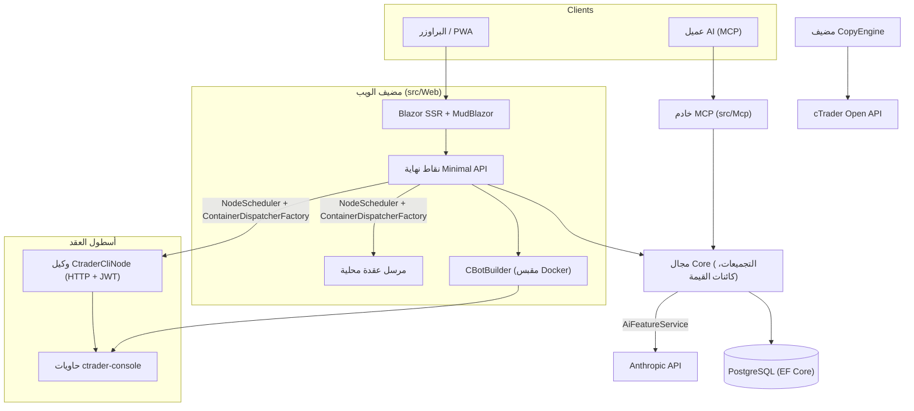

# نظرة عامة على المعمارية

cMind هي منصة متعددة المستأجرين **Blazor Server + Minimal API** لـ cTrader، مبنية على **.NET 10 / C# 14**، EF Core + PostgreSQL، و.NET Aspire، مع خادم MCP وأساس AI. يتبع **Strict Domain-Driven Design**: تعيش قواعد الأعمال على التجميعات وكائنات القيمة في `Core` نقي، وكل شيء آخر ينظم.

هذه الصفحة هي الخريطة. للحصول على *السبب* خلف الخيارات المحددة، انظر [سجلات قرار المعمارية](./adr/README.md).

## الوحدات

| المشروع | المسؤولية |
|---|---|
| `src/Core` | المجال النقي — الكيانات، التجميعات، كائنات القيمة، معرفات قوية، أحداث المجال، واجهات Core. **صفر** تبعيات البنية التحتية (لا EF/HttpClient/Docker/ASP.NET). |
| `src/Infrastructure` | EF Core + PostgreSQL، تشفير DataProtection، عميل GHCR، عميل Anthropic AI، قابلية المراقبة. |
| `src/Nodes` | تنسيق عبر العقد — الجدولة، الإرسال، الاستطلاعات، الخدمات الخلفية. |
| `src/CtraderCliNode` | وكيل عقدة HTTP مستقل على المضيفين البعيدين (مصادقة JWT، بدون shell). يشغل واختبارات cBots من خلال قيادة **cTrader CLI** داخل حاوية docker - وسيحسن أيضاً، بمجرد إضافة cTrader CLI. |
| `src/CopyEngine` | مضيف copy-trading: المرايا الحرة من حساب المصدر على الوجهات. |
| `src/CTraderOpenApi` | عميل cTrader Open API (protobuf over TCP/SSL) - المصادقة، جلسة التداول، الإنصاف. |
| `src/Web` | Blazor Server SSR + Minimal API + SignalR + MudBlazor UI. |
| `src/Mcp` | خادم MCP HTTP+SSE يعرض الأدوات على عملاء AI. |
| `src/AppHost` | منسق .NET Aspire (Postgres، Web، MCP، pgAdmin). |

## الصورة الكبيرة

## تدفقات الطلب

### البناء والاختبار

1. يقدم المستخدم مشروع مصدر cBot. يعمل `CBotBuilder` **على مضيف الويب** (يحتاج مقبس Docker) داخل حاوية SDK قابلة للتجاهل مع `/work` مرتبط بالربط وحجم `app-nuget-cache` مشترك، لذا لا يمكن لـ MSBuild غير الموثوق الوصول إلى نظام ملفات المضيف أو الشبكة.
2. تعمل حاويات التشغيل/الاختبار على عقدة من اختيار `NodeScheduler`، موزعة عبر `ContainerDispatcherFactory` → أما `Http` (وكيل `CtraderCliNode` بعيد) أو `Local` (عقدة المضيف الويب الخاصة).
3. تشغيل الحاويات `ghcr.io/spotware/ctrader-console` مع `--exit-on-stop`. استطلاعات (`RunCompletionPoller`، `BacktestCompletionPoller`) المصالحة الحاويات ذاتية الخروج: الخروج 0/null ⇒ محقق، غير صفري ⇒ فشل.

حالة المثيل هي **TPH، والانتقال يستبدل الكيان** (لا يمكن تغيير المميز)، لذا **معرف المثيل يتغير** بدء التشغيل → تشغيل → نهائي. **معرف الحاوية مستقر** ويتم نقله؛ وكيل HTTP مفتاحه برقم حاوية لحالة/تقرير/إيقاف/السجلات.

### عقد cTrader CLI

عقد cTrader CLI تحصل على **لا SSH ولا shell**. يتحدث التطبيق الرئيسي إلى كل وكيل عبر HTTP؛ كل طلب يحمل **HS256 JWT** قصير الأجل (5 دقائق، `iss=app-main` / `aud=app-node`) موقعة بسر تلك العقدة. الوكيل فقط يشغل الصور التي تطابق `AllowedImagePrefix`، execs docker عبر `ArgumentList` (أبداً shell)، وبدون حالة (يجد الحاويات حسب `app.instance` label). وكلاء التسجيل الذاتي والنبض إلى `POST /api/nodes/register`؛ يقوم التطبيق الرئيسي بتحديث/إدراج `CtraderCliNode` **حسب الاسم** لذا تنجو العقدة من تغييرات IP.

### نسخ التداول

`CopyEngineSupervisor` (أ `BackgroundService`) المصالحة المتكررة ملفات تعريف النسخ مع حي `CopyEngineHost` instances - المطالبة الملفات الشخصية عبر عقد قاعدة بيانات ذرية (حتى لا تنسخ عقدتان أبداً)، تجديد العقود، وإعادة تشغيل المضيفين الأموات. كل `CopyEngineHost` يتصل بـ cTrader Open API، يعكس تنفيذات المصدر على الوجهات عبر المحرك النقي `CopyDecisionEngine` (المرشحات الاتجاهية/الكمون/الانزلاق + التحجيم)، والشفاء الذاتي عبر resync + تصحيح الملء الجزئي.

### AI

AI هو **مبواب بالكامل على `AppOptions.Ai.ApiKey`** — unset ⇒ كل ميزة تعيد `AiResult.Fail` والتطبيق يعمل بدون تغيير (لا مفتاح مطلوب للبناء/الاختبار/E2E). `IAiClient` يستدعي Anthropic عبر **HTTP خام** (typed `HttpClient`)، بشكل متعمد ليس SDK. `AiFeatureService` هو المنسق الوحيد المشترك بين نقاط نهاية الويب وأدوات MCP و`AiRiskGuard`.

## قواعد عبر القطع

- **واحد `SaveChanges` يحور تجميع واحد.** التدفقات عبر التجميعات استخدم أحداث المجال موزعة من قبل مقاطع EF.
- **التجميعات تشير إلى بعضها البعض بواسطة معرف قوي**، أبداً خاصية التنقل.
- **لا ساعة محيطة.** كود injects `TimeProvider`؛ طرق المجال تأخذ `DateTimeOffset now`.
- **الأسرار** مشفرة عبر `ISecretProtector` (`EncryptionPurposes`); **السلاسل** تعيش في `Core/Constants/`; **السجلات** تذهب عبر المصدر المولد `LogMessages`.

هذه يتم فرضها في CI: الفحص الذي يجرفه، البناء الصفر-تحذير، و`ArchitectureGuardTests` (الذي يفشل البناء على ساعة محيطة قراءة، إدارة بنية تحتية Core، أو مباشر `ILogger.Log*` استدعاء).
