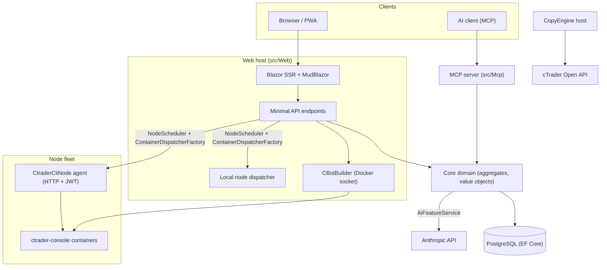

# Architektur-Übersicht

cMind ist eine Multi-Tenant-Plattform aus **Blazor Server + Minimal API** für cTrader, gebaut auf **.NET 10 / C# 14**, EF Core + PostgreSQL und .NET Aspire, mit einem MCP-Server und einem KI-Kern. Sie folgt **striktem Domain-Driven Design**: Geschäftsregeln leben auf Aggregaten und Value Objects in einem reinen `Core`, und der Rest orchestriert.

Diese Seite ist die Karte. Für das *Warum* hinter spezifischen Entscheidungen, siehe die [Architektur-Entscheidungsprotokolle](./adr/README.md).

## Module

| Projekt | Verantwortung |
|---|---|
| `src/Core` | Reiner Domain – Entities, Aggregate, Value Objects, Strong IDs, Domain Events, Core-seitige Interfaces. **Null** Infrastruktur-Abhängigkeiten (kein EF/HttpClient/Docker/ASP.NET). |
| `src/Infrastructure` | EF Core + PostgreSQL, DataProtection-Verschlüsselung, GHCR-Client, Anthropic-KI-Client, Observability. |
| `src/Nodes` | Cross-Node-Orchestration – Planung, Versand, Poller, Background Services. |
| `src/CtraderCliNode` | Eigenständiger HTTP-Node-Agent auf Remote-Hosts (JWT-Auth, keine Shell). Führt cBots aus und testet sie durch das Fahren der **cTrader CLI** in einem Docker-Container – und wird auch optimiert, sobald die cTrader CLI es hinzufügt. |
| `src/CopyEngine` | Der Copy-Trading-Host: spiegelt Trades von einem Quellkonto zu Zielen. |
| `src/CTraderOpenApi` | cTrader Open API-Client (Protobuf über TCP/SSL) – Auth, Trading-Sitzung, Eigenkapital. |
| `src/Web` | Blazor Server SSR + Minimal API + SignalR + MudBlazor UI. |
| `src/Mcp` | MCP HTTP+SSE-Server exposing Tools für KI-Clients. |
| `src/AppHost` | .NET Aspire-Orchestrator (Postgres, Web, MCP, pgAdmin). |

## Das Gesamtbild

## Request-Flüsse

### Build & Backtest

1. Ein Benutzer reicht ein cBot-Quellprojekt ein. `CBotBuilder` läuft **auf dem Web-Host** (benötigt den Docker-Socket) in einem einmaligen SDK-Container mit einem Bind-gemounteten `/work` und einem gemeinsamen `app-nuget-cache`-Volume, damit untrusted MSBuild nicht das Host-Dateisystem oder Netzwerk erreichen kann.
2. Run-/Backtest-Container führen auf einem von `NodeScheduler` gewählten Node aus, über `ContainerDispatcherFactory` versandt → entweder `Http` (ein Remote-`CtraderCliNode`-Agent) oder `Local` (der eigene Node des Web-Hosts).
3. Container führen `ghcr.io/spotware/ctrader-console` mit `--exit-on-stop` aus. Poller (`RunCompletionPoller`, `BacktestCompletionPoller`) versöhnen selbst-exiting Container: Exit 0/null ⇒ Stopped, nicht-null ⇒ Failed.

Instance-Status ist **TPH, und ein Übergang ersetzt die Entity** (der Diskriminator kann nicht geändert werden), also ändert sich eine Instance-**ID** starting → running → terminal. Die **Container-ID ist stabil** und wird mitgenommen; der HTTP-Agent wird durch Container-ID für Status/Report/Stop/Logs schlüsselt.

### cTrader CLI Nodes

cTrader CLI Nodes bekommen **keine SSH oder Shell**. Die Haupt-App spricht mit jedem Agent über HTTP; jede Anfrage trägt ein kurzlebiges HS256-**JWT** (5 Minuten, `iss=app-main` / `aud=app-node`), das mit dem Node-Secret des Agenten signiert ist. Der Agent führt nur Images aus, die `AllowedImagePrefix` entsprechen, execs docker über `ArgumentList` (nie eine Shell), und ist zustandslos (findet Container über das `app.instance`-Label).
Agents registrieren sich selbst und machen Heartbeat zu `POST /api/nodes/register`; die Haupt-App upsert den `CtraderCliNode` **nach Name**, damit sie IP-Änderungen überstehen.

### Copy Trading

`CopyEngineSupervisor` (ein `BackgroundService`) versöhnt laufende Copy-Profile mit Live-`CopyEngineHost`-Instanzen – behauptet Profile über einen atomaren DB-Lease (so kopieren zwei Nodes nie doppelt), erneuert Leases und startet tote Hosts neu. Jeder `CopyEngineHost` verbindet sich mit der cTrader Open API, spiegelt Source-Ausführungen zu Zielen durch den reinen `CopyDecisionEngine` (Direction-/Latenz-/Slippage-Filter + Sizing), und self-heals über Resync + Partial-Fill True-up.

### KI

KI ist **vollständig gated auf `AppOptions.Ai.ApiKey`** – nicht gesetzt ⇒ jedes Feature gibt `AiResult.Fail` zurück und die App läuft unverändert (kein Schlüssel nötig für Build/Test/E2E). `IAiClient` ruft Anthropic über **rohes HTTP** auf (ein typisierter `HttpClient`), absichtlich nicht das SDK. `AiFeatureService` ist der einzige Orchestrator, der von Web-Endpoints, den MCP-`AiTools` und `AiRiskGuard` geteilt wird.

## Cross-Cutting Rules

- **Ein `SaveChanges` mutiert ein Aggregat.** Cross-Aggregat-Flüsse verwenden Domain Events, die von einem EF-Interceptor versandt werden.
- **Aggregate referenzieren sich gegenseitig über Strong ID**, nie Navigationseigenschaft.
- **Keine Ambient Clock.** Code injiziert `TimeProvider`; Domain-Methoden nehmen einen `DateTimeOffset now`-Parameter vom Aufrufer.
- **Secrets** werden über `ISecretProtector` (`EncryptionPurposes`) verschlüsselt; **Strings** leben in `Core/Constants/`; **Logs** gehen durch Source-generierte `LogMessages`.

Diese werden in CI durchgesetzt: der Analyzer Sweep, der Null-Warning-Build und `ArchitectureGuardTests` (die den Build auf einen Ambient-Clock-Read, eine Core-Infra-Abhängigkeit oder einen direkten `ILogger.Log*`-Aufruf fehlschlagen lassen).
