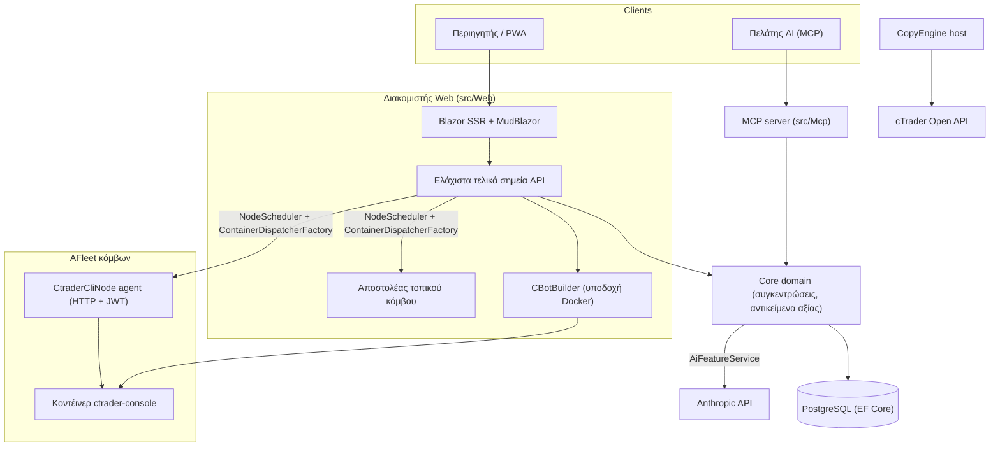

# Επισκόπηση Αρχιτεκτονικής

Το cMind είναι μια πολυ-ενοικιάσιμη **πλατφόρμα Blazor Server + Minimal API** για cTrader, κατασκευασμένη σε **.NET 10 /
C# 14**, EF Core + PostgreSQL, και .NET Aspire, με έναν MCP server και ένα AI core. Ακολουθεί
**αυστηρό Domain-Driven Design**: οι κανόνες επιχειρήσεων ζουν σε συγκεντρώσεις και αντικείμενα αξίας σε ένα καθαρό
`Core`, και όλα τα άλλα ορχηστρώνουν.

Αυτή η σελίδα είναι ο χάρτης. Για το *γιατί* πίσω από συγκεκριμένες επιλογές, δείτε τις
[Αρχιτεκτονικές Αποfaçadeiseις](./adr/README.md).

## Modules

| Έργο | Ευθύνη |
|---|---|
| `src/Core` | Καθαρή περιοχή — οντότητες, συγκεντρώσεις, αντικείμενα αξίας, ισχυρά IDs, γεγονότα τομέα, διεπαφές πλευράς Core. **Μηδέν** εξάρτηση υποδομής (όχι EF/HttpClient/Docker/ASP.NET). |
| `src/Infrastructure` | EF Core + PostgreSQL, κρυπτογράφηση DataProtection, πελάτης GHCR, πελάτης AI Anthropic, παρατηρησιμότητα. |
| `src/Nodes` | Διασυν-κόμβου ορχήστρευση — προγραμματισμός, αποστολή, δημοσκοπήσεις, υπηρεσίες υποβάθρου. |
| `src/CtraderCliNode` | Αυτόνομος πράκτορας HTTP κόμβου σε απομακρυσμένους κόμβους (έλεγχος ταυτότητας JWT, χωρίς κέλυφος). Τρέχει και backtests cBots οδηγώντας το **cTrader CLI** μέσα σε κοντέινερ docker — και θα βελτιστοποιήσει επίσης, μόλις το cTrader CLI το προσθέσει. |
| `src/CopyEngine` | Ο κεντρικός υπολογιστής αντιγραφής-διαπραγμάτευσης: αντανακλάει τις συναλλαγές από έναν λογαριασμό προέλευσης στους προορισμούς. |
| `src/CTraderOpenApi` | Πελάτης cTrader Open API (protobuf σε TCP/SSL) — έλεγχος ταυτότητας, συνεδρία διαπραγμάτευσης, δικαιοσύνη. |
| `src/Web` | Blazor Server SSR + Minimal API + SignalR + MudBlazor UI. |
| `src/Mcp` | MCP HTTP+SSE server εκθέτοντας εργαλεία στους πελάτες AI. |
| `src/AppHost` | .NET Aspire ορχηστράρης (Postgres, Web, MCP, pgAdmin). |

## Η μεγάλη εικόνα

## Ροές αίτησης

### Κατασκευή & backtest

1. Ένας χρήστης υποβάλλει έναν πηγαίο έργο cBot. Ο `CBotBuilder` εκτελείται **στον διακομιστή web** (χρειάζεται την
   υποδοχή Docker) μέσα σε ένα κοντέινερ SDK που πετάγεται με έναν κατάλογο `/work` που συνδέεται και έναν κοινόχρηστο
   όγκο `app-nuget-cache`, έτσι ώστε αναξιόπιστη MSBuild να μην μπορεί να φτάσει στο σύστημα αρχείων του κεντρικού υπολογιστή ή το δίκτυο.
2. Τα κοντέινερ εκτέλεσης/backtest εκτελούνται σε έναν κόμβο που επιλέγεται από `NodeScheduler`, που αποστέλλεται μέσω
   `ContainerDispatcherFactory` → είτε `Http` (ένας απομακρυσμένος πράκτορας `CtraderCliNode`) ή `Local` (ο ίδιος κόμβος του διακομιστή web).
3. Τα κοντέινερ τρέχουν `ghcr.io/spotware/ctrader-console` με `--exit-on-stop`. Δημοσκοπήσεις
   (`RunCompletionPoller`, `BacktestCompletionPoller`) συμφωνούν κοντέινερ που αυτο-εξέρχονται: έξοδος 0/null
   ⇒ Σταμάτησαν, μη-μηδέν ⇒ Απέτυχα.

Η κατάσταση παρουσίας είναι **TPH, και μια μετάβαση αντικαθιστά την οντότητα** (ο διακριτικός δεν μπορεί να αλλάξει), έτσι
ένα αναγνωριστικό παρουσίας **αλλάζει** έναρξη → εκτέλεση → τερματική. Το **αναγνωριστικό κοντέινερ είναι σταθερό** και μεταφέρεται.
ο πράκτορας HTTP καλύπτεται μέσω αναγνωριστικού κοντέινερ για κατάσταση/αναφορά/διακοπή/αρχεία καταγραφής.

### Κόμβοι cTrader CLI

Οι κόμβοι cTrader CLI λαμβάνουν **όχι SSH ή κέλυφος**. Η κύρια εφαρμογή μιλά σε κάθε πράκτορα μέσω HTTP. κάθε αίτημα
φέρει βραχύβιο HS256 **JWT** (5 λεπτά, `iss=app-main` / `aud=app-node`) υπογεγραμμένο με το μυστικό του κόμβου. Ο πράκτορας εκτελεί μόνο εικόνες που ταιριάζουν `AllowedImagePrefix`, exec docker μέσω
`ArgumentList` (ποτέ κέλυφος), και είναι stateless (εντοπίζει κοντέινερ από την ετικέτα `app.instance`).
Οι πράκτορες αυτορεγιστράρησης και χτύπησης καρδιάς σε `POST /api/nodes/register`. η κύρια εφαρμογή εξασφαλίζει το
`CtraderCliNode` **κατά όνομα** ώστε να επιζεί στις αλλαγές IP.

### Αντιγραφή διαπραγμάτευσης

Ο `CopyEngineSupervisor` (α `BackgroundService`) συμφωνεί ζωντανές παρουσίες αντιγράφου με ζωντανό
`CopyEngineHost` — διεκδικώντας προφίλ μέσω ενός ατομικού DB μισθώματος (έτσι δύο κόμβοι ποτέ
διπλό-αντιγραφή), ανανέωση μισθωμάτων, και επανεκκίνηση νεκρών κόμβων. Κάθε `CopyEngineHost` συνδέεται με το
cTrader Open API, αντανακλάται εκτέλεση προέλευσης στους προορισμούς μέσα από τον καθαρό `CopyDecisionEngine`
(κατευθυνσιακά/latency/slippage φίλτρα + μέγεθος), και αυτο-θεραπείες μέσω resync + μερικής-γεμάτης αληθοποίησης.

### AI

Ο AI είναι **πλήρως περιορισμένος στο `AppOptions.Ai.ApiKey`** — αδιευθυντή ⇒ κάθε δυνατότητα επιστρέφει `AiResult.Fail` και
η εφαρμογή εκτελείται αμετάβλητη (δεν χρειάζεται κλειδί για κατασκευή/δοκιμή/E2E). Ο `IAiClient` καλεί Anthropic σε **ακατέργαστο
HTTP** (ένας τυποποιημένος `HttpClient`), σκόπιμα όχι το SDK. Ο `AiFeatureService` είναι ο ενιαίος
ορχηστράρης που μοιράζονται Web endpoints, τα MCP `AiTools`, και `AiRiskGuard`.

## Κανόνες διασταύρωσης

- **Ένας `SaveChanges` μεταλλάσσει μία συγκέντρωση.** Οι ροές μεταξύ συγκεντρώσεων χρησιμοποιούν γεγονότα τομέα που διαστέλλονται από
  ένα ανιχνευτή EF.
- **Οι συγκεντρώσεις αναφέρουν η μία την άλλη με ισχυρό ID**, ποτέ ιδιότητα πλοήγησης.
- **Χωρίς περιβάλλον ρολόι.** Ο κώδικας ενέχει `TimeProvider`. οι μέθοδοι τομέα λαμβάνουν ένα `DateTimeOffset now` παράμετρος από τον καλούντα.
- **Μυστικά** είναι κρυπτογραφημένα μέσω `ISecretProtector` (`EncryptionPurposes`). **συμβολοσειρές** ζουν σε
  `Core/Constants/`. **Αρχεία καταγραφής** πηγαίνουν μέσω πηγαίας παραγωγής `LogMessages`.

Αυτά επιβάλλονται σε CI: το αναλυτή σάρωση, η κατασκευή μηδέν-προειδοποίηση, και
`ArchitectureGuardTests` (που αποτυγχάνουν την κατασκευή σε μια περιβάλλουσα ανάγνωση ρολογιού, μια Core infra εξάρτηση, ή
μια ευθεία κλήση `ILogger.Log*`).
