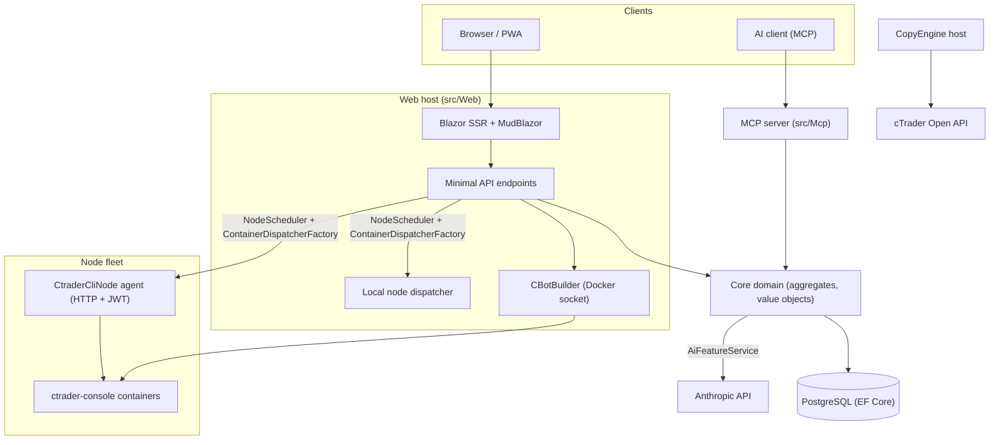

# Descripción general de la arquitectura

cMind es una plataforma multiusuario **Blazor Server + API mínima** para cTrader, construida en **.NET 10 /
C# 14**, EF Core + PostgreSQL y .NET Aspire, con un servidor MCP y un núcleo de IA. Sigue
**Diseño guiado por el dominio estricto**: las reglas de negocio viven en agregados y objetos de valor en un `Core` puro,
y todo lo demás orquesta.

Esta página es el mapa. Para el *por qué* detrás de decisiones específicas, ver los
[Registros de decisiones arquitectónicas](./adr/README.md).

## Módulos

| Proyecto | Responsabilidad |
|---|---|
| `src/Core` | Dominio puro — entidades, agregados, objetos de valor, identificadores fuerte, eventos de dominio, interfaces del lado del Core. **Cero** dependencias de infra (sin EF/HttpClient/Docker/ASP.NET). |
| `src/Infrastructure` | EF Core + PostgreSQL, encriptación DataProtection, cliente GHCR, cliente de IA Anthropic, observabilidad. |
| `src/Nodes` | Orquestación entre nodos — programación, despacho, pollers, servicios de fondo. |
| `src/CtraderCliNode` | Agente de nodo HTTP independiente en hosts remotos (autenticación JWT, sin shell). Ejecuta y hace backtest de cBots al conducir la **CLI de cTrader** dentro de un contenedor docker — y también optimizará, una vez que la CLI de cTrader la agregue. |
| `src/CopyEngine` | El host de copia comercial: espeja transacciones de una cuenta fuente en destinos. |
| `src/CTraderOpenApi` | Cliente de API abierto de cTrader (protobuf sobre TCP/SSL) — autenticación, sesión de trading, equidad. |
| `src/Web` | Blazor Server SSR + API mínima + SignalR + Interfaz de usuario MudBlazor. |
| `src/Mcp` | Servidor MCP HTTP+SSE que expone herramientas a clientes de IA. |
| `src/AppHost` | Orquestador .NET Aspire (Postgres, Web, MCP, pgAdmin). |

## El panorama general

## Flujos de solicitud

### Compilación y backtest

1. Un usuario envía un proyecto fuente de cBot. `CBotBuilder` se ejecuta **en el host web** (necesita el socket
   Docker) dentro de un contenedor SDK desechable con `/work` montado en enlace y un volumen compartido
   `app-nuget-cache`, para que MSBuild no confiable no pueda acceder al sistema de archivos o la red del host.
2. Los contenedores de ejecución/backtest se ejecutan en un nodo elegido por `NodeScheduler`, despachado a través
   de `ContainerDispatcherFactory` → `Http` (un agente remoto `CtraderCliNode`) o `Local` (el propio nodo del host web).
3. Los contenedores ejecutan `ghcr.io/spotware/ctrader-console` con `--exit-on-stop`. Los pollers
   (`RunCompletionPoller`, `BacktestCompletionPoller`) reconcilian contenedores que salen por sí solos: salida 0/null
   ⇒ Detenido, no cero ⇒ Falló.

El estado de la instancia es **TPH, y una transición reemplaza la entidad** (el discriminador no puede cambiar), por lo que
una instancia **el id cambia** iniciando → ejecutando → terminal. El **id del contenedor es estable** y se lleva
adelante; el agente HTTP se indexa por id de contenedor para estado/informe/parada/registros.

### Nodos CLI de cTrader

Los nodos CLI de cTrader obtienen **sin SSH o shell**. La aplicación principal se comunica con cada agente por HTTP; cada solicitud
lleva un **JWT** de corta duración HS256 (5 minutos, `iss=app-main` / `aud=app-node`) firmado con ese
secreto del nodo. El agente solo ejecuta imágenes que coinciden con `AllowedImagePrefix`, ejecuta docker vía
`ArgumentList` (nunca un shell), y no tiene estado (encuentra contenedores por la etiqueta `app.instance`).
Los agentes se auto-registran y envían latidos a `POST /api/nodes/register`; la aplicación principal actualiza el
`CtraderCliNode` **por nombre** para que sobreviva cambios de IP.

### Copia comercial

`CopyEngineSupervisor` (un `BackgroundService`) reconcilia perfiles de copia en ejecución con instancias en vivo
`CopyEngineHost` — perfiles reclamantes vía arrendamiento DB atómico (para que dos nodos nunca
dupliquen), renovando arrendamientos y reiniciando hosts muertos. Cada `CopyEngineHost` se conecta a la
API abierta de cTrader, espeja ejecuciones de fuente en destinos a través del puro `CopyDecisionEngine`
(filtros de dirección/latencia/deslizamiento + tamaño), y se auto-cura vía resync + true-up de llenado parcial.

### IA

La IA es **completamente puertas en `AppOptions.Ai.ApiKey`** — no configurada ⇒ cada característica devuelve `AiResult.Fail` y
la aplicación se ejecuta sin cambios (no se necesita clave para compilación/prueba/E2E). `IAiClient` llama a Anthropic sobre **raw
HTTP** (un `HttpClient` tipado), deliberadamente no el SDK. `AiFeatureService` es el único
orquestador compartido por puntos finales web, el MCP `AiTools`, y `AiRiskGuard`.

## Reglas transversales

- **Una `SaveChanges` muta un agregado.** Los flujos entre agregados utilizan eventos de dominio despachados por
  un interceptor EF.
- **Los agregados se hacen referencia entre sí por ID fuerte**, nunca propiedad de navegación.
- **Sin reloj ambiente.** El código inyecta `TimeProvider`; los métodos de dominio toman un `DateTimeOffset now`.
- **Secretos** se cifran vía `ISecretProtector` (`EncryptionPurposes`); **strings** viven en
  `Core/Constants/`; **registros** pasan por `LogMessages` generado por fuente.

Estos se aplican en CI: el barrido del analizador, la compilación sin advertencias y
`ArchitectureGuardTests` (que fallan la compilación en una lectura de reloj ambiente, una dependencia de infra de Core o
una llamada directa `ILogger.Log*`).
