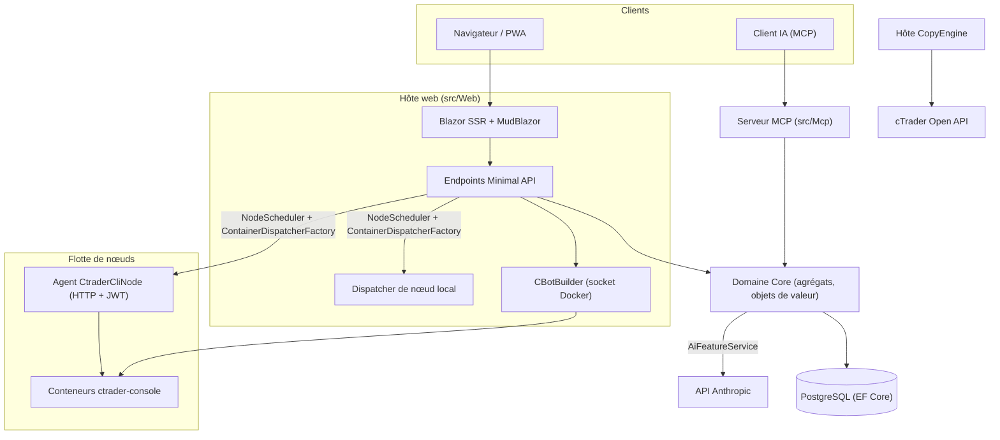

# Aperçu de l'architecture

cMind est une plateforme multi-client **Blazor Server + Minimal API** pour cTrader, construite sur **.NET 10 / C# 14**, EF Core + PostgreSQL, et .NET Aspire, avec un serveur MCP et un noyau IA. Elle suit une **approche Domain-Driven Design stricte** : les règles métier vivent sur les agrégats et les objets de valeur dans un `Core` pur, et tout le reste orchestre.

Cette page est la carte. Pour comprendre le *pourquoi* de choix spécifiques, voir les [Architecture Decision Records](./adr/README.md).

## Modules

| Projet | Responsabilité |
|---|---|
| `src/Core` | Domaine pur — entités, agrégats, objets de valeur, ID forts, événements de domaine, interfaces côté Core. **Zéro** dépendances infra (pas d'EF/HttpClient/Docker/ASP.NET). |
| `src/Infrastructure` | EF Core + PostgreSQL, chiffrement DataProtection, client GHCR, client IA Anthropic, observabilité. |
| `src/Nodes` | Orchestration inter-nœuds — ordonnancement, dispatch, pollers, services de fond. |
| `src/CtraderCliNode` | Agent HTTP nœud autonome sur hôtes distants (authentification JWT, pas de shell). Exécute et backteste les cBots en pilotant la **cTrader CLI** dans un conteneur docker — et optimisera aussi, une fois que la cTrader CLI l'ajoutera. |
| `src/CopyEngine` | L'hôte de copy-trading : reflète les échanges du compte source vers les destinations. |
| `src/CTraderOpenApi` | Client cTrader Open API (protobuf sur TCP/SSL) — authentification, session de trading, équité. |
| `src/Web` | Blazor Server SSR + Minimal API + SignalR + MudBlazor UI. |
| `src/Mcp` | Serveur MCP HTTP+SSE exposant les outils aux clients IA. |
| `src/AppHost` | Orchestrateur .NET Aspire (Postgres, Web, MCP, pgAdmin). |

## La vue d'ensemble

## Flux de requêtes

### Build & backtest

1. Un utilisateur soumet un projet source de cBot. `CBotBuilder` s'exécute **sur l'hôte web** (il a besoin de la socket Docker) dans un conteneur SDK jetable avec un `/work` en bind-mount et un volume partagé `app-nuget-cache`, afin que MSBuild non fiable ne puisse pas accéder au système de fichiers ou au réseau de l'hôte.
2. Les conteneurs Run/backtest s'exécutent sur un nœud choisi par `NodeScheduler`, dispatché par `ContainerDispatcherFactory` → soit `Http` (un agent `CtraderCliNode` distant) soit `Local` (le nœud de l'hôte web).
3. Les conteneurs exécutent `ghcr.io/spotware/ctrader-console` avec `--exit-on-stop`. Les pollers (`RunCompletionPoller`, `BacktestCompletionPoller`) réconciliant les conteneurs auto-arrêtés : sortie 0/null ⇒ Stopped, non-zéro ⇒ Failed.

L'état de l'instance est **TPH, et une transition remplace l'entité** (le discriminateur ne peut pas changer), donc une instance **change d'id** starting → running → terminal. L'**id du conteneur est stable** et porté ; l'agent HTTP est indexé par id de conteneur pour le statut/rapport/arrêt/logs.

### Nœuds cTrader CLI

Les nœuds cTrader CLI n'ont **ni SSH ni shell**. L'app principale communique avec chaque agent via HTTP ; chaque requête porte un **JWT** HS256 de courte durée (5 minutes, `iss=app-main` / `aud=app-node`) signé avec le secret de ce nœud. L'agent exécute uniquement les images correspondant à `AllowedImagePrefix`, exécute docker via `ArgumentList` (jamais un shell), et est sans état (il trouve les conteneurs par le label `app.instance`). Les agents s'enregistrent automatiquement et envoient un heartbeat vers `POST /api/nodes/register` ; l'app principale fait un upsert de `CtraderCliNode` **par nom** afin qu'il survive aux changements d'IP.

### Copy trading

`CopyEngineSupervisor` (un `BackgroundService`) réconcilie les profils de copie en cours d'exécution avec les instances `CopyEngineHost` en direct — revendiquant les profils via un bail atomique DB (afin que deux nœuds ne fassent jamais de double-copie), renouvelant les baux, et redémarrant les hôtes morts. Chaque `CopyEngineHost` se connecte à la cTrader Open API, reflète les exécutions sources sur les destinations via le `CopyDecisionEngine` pur (filtres de direction/latence/slippage + dimensionnement), et s'auto-guérit via resync + true-up de remplissage partiel.

### IA

L'IA est **entièrement contrôlée par `AppOptions.Ai.ApiKey`** — non définie ⇒ chaque fonctionnalité renvoie `AiResult.Fail` et l'app fonctionne inchangée (aucune clé nécessaire pour build/test/E2E). `IAiClient` appelle Anthropic sur **raw HTTP** (un `HttpClient` typé), intentionnellement pas le SDK. `AiFeatureService` est l'orchestrateur unique partagé par les endpoints Web, les `AiTools` MCP, et `AiRiskGuard`.

## Règles transversales

- **Un `SaveChanges` mute un agrégat.** Les flux inter-agrégats utilisent des événements de domaine dispatché par un intercepteur EF.
- **Les agrégats se référencent entre eux par ID fort**, jamais par propriété de navigation.
- **Pas d'horloge ambiante.** Le code injecte `TimeProvider` ; les méthodes de domaine prennent un `DateTimeOffset now`.
- **Secrets** sont chiffrés via `ISecretProtector` (`EncryptionPurposes`) ; **chaînes** vivent dans `Core/Constants/` ; **logs** vont par `LogMessages` générés par source.

Ces éléments sont appliqués en CI : l'analyse sweep, le build sans avertissement, et `ArchitectureGuardTests` (qui échouent le build sur une lecture d'horloge ambiante, une dépendance infra Core, ou un appel `ILogger.Log*` direct).
