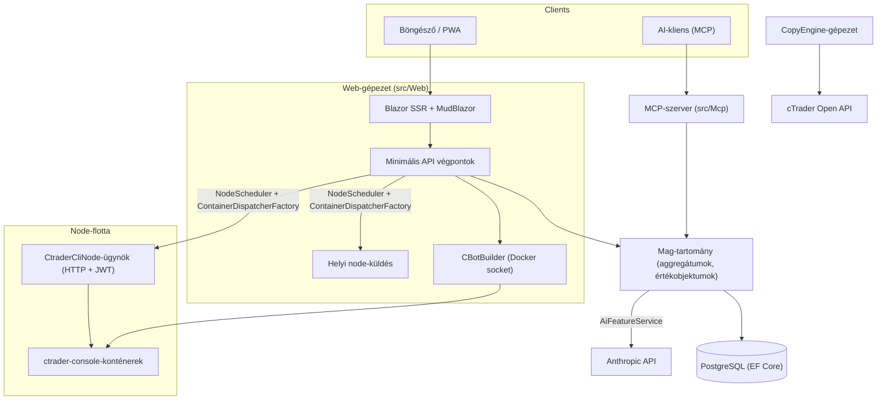

# Architektura áttekintés

A cMind egy multi-bérlős **Blazor szerver + minimális API** platform a cTrader-hez, a **.NET 10 / C# 14**, EF Core + PostgreSQL és .NET Aspire-hoz építve, egy MCP-szerverrel és egy AI-maggal. Az követi a **szigorú Domain-Driven Design**: az üzleti szabályok az egy tiszta `Core`-ban az agregátumokon és értékobjektumokon élnek, és mindent mást a levezénylő.

Ez az oldal a térkép. Az *miért* konkrét választások mögött, lásd az [Architektura döntési nyilvántartás](./adr/README.md).

## Modulok

| Projekt | Felelősség |
|---|---|
| `src/Core` | Tiszta tartomány — entitások, aggregátumok, értékobjektumok, erős ID-k, tartomány-események, Core-oldalú interfészek. **Nulla** infra függőség (nincs EF/HttpClient/Docker/ASP.NET). |
| `src/Infrastructure` | EF Core + PostgreSQL, DataProtection titkosítás, GHCR-kliens, Anthropic AI-kliens, megfigyelhető. |
| `src/Nodes` | Cross-node levezénylés — ütemezés, küldés, szavazók, háttéri szolgáltatások. |
| `src/CtraderCliNode` | Önálló HTTP node-ügynök a távolsági gépeken (JWT-hitelesítés, nincs shell). Futtatja és backtesteli a cBot-okat a **cTrader CLI** a docker-konténeren belüli meghajtásával — és optimalizál is, miután a cTrader CLI felvenné. |
| `src/CopyEngine` | A másolási kereskedési gépezet: tükrözi az egy forrás-számla kereskedéseit a célokra. |
| `src/CTraderOpenApi` | cTrader Open API-kliens (protobuf TCP/SSL-en keresztül) — hitelesítés, kereskedelmi ülés, saját tőke. |
| `src/Web` | Blazor szerver SSR + minimális API + SignalR + MudBlazor UI. |
| `src/Mcp` | MCP HTTP+SSE szerver az eszközöket az AI-ügyfeleknek teszi elérhetővé. |
| `src/AppHost` | .NET Aspire levezénylő (Postgres, Web, MCP, pgAdmin). |

## A nagy kép

## Kérés-áramlások

### Építés & backtest

1. Egy felhasználó egy cBot-forrás projektet nyújt be. A `CBotBuilder` **a web-gépen futó** (szüksége van a Docker socketra) egy eldobható SDK-konténeren belül egy kötött `/work` és egy megosztott `app-nuget-cache` kötettel, így a nem megbízható MSBuild nem érheti el a gépfájlrendszert vagy hálózatot.
2. A futtatási/backtest-konténerek egy `NodeScheduler` által választott csomóponton futnak, a `ContainerDispatcherFactory` segítségével elküldve → akár `Http` (egy távolsági `CtraderCliNode`-ügynök), akár `Local` (a web-gépezet saját csomópontja).
3. A konténerek futtatják a `ghcr.io/spotware/ctrader-console` értéket az `--exit-on-stop` értékkel. Az szavazók (`RunCompletionPoller`, `BacktestCompletionPoller`) a kiléptett konténereket egyeztetnek: a 0/null exit ⇒ leállított, a nem-nulla ⇒ sikertelen.

Az instancia-állapot **TPH, és az átmenet helyettesíti az entitást** (a megkülönböztetési nem módosulhat), így az instancia **id módosítása** indítás → futtatás → véglegesen. A **konténer id stabil** és átkerül; a HTTP-ügynök a konténer azonosítójával indexelve van az állapot/jelentés/leállítás/naplók számára.

### cTrader CLI node-ok

A cTrader CLI node-ok **nincs SSH vagy shell**. A főalkalmazás HTTP-n keresztül beszél minden ügynökkel; minden kérés egy rövid élettartamú HS256 **JWT**-ot hordoz (5 perc, `iss=app-main` / `aud=app-node`) az adott csomópont titkával aláírva. Az ügynök csak az `AllowedImagePrefix`-nek megfelelő képeket futtatja, a docker-t az `ArgumentList` segítségével futtatja (soha nem shell), és állapot nélküli (az konténereket az `app.instance` label alapján találja meg). Az ügynökök önmaga regisztrálnak és szívveréssel jelentkeznek a `POST /api/nodes/register`-hez; a főalkalmazás az `CtraderCliNode`-ot **név alapján** felülír, így túléli az IP-változásokat.

### Másolási kereskedés

A `CopyEngineSupervisor` (egy `BackgroundService`) a futó másolási profilokat az élő
