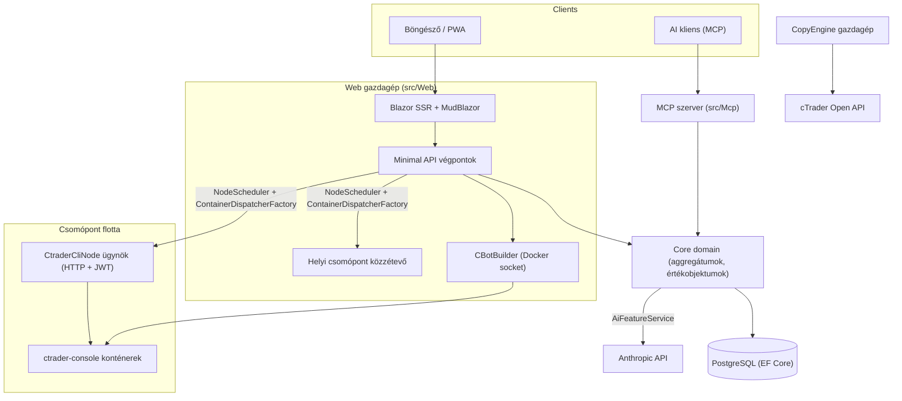

# Architektura áttekintés

cMind egy több-bérlős **Blazor Server + Minimal API** platform cTrader számára, amely a **.NET 10 / C# 14**, EF Core + PostgreSQL és .NET Aspire alapuló, MCP szerverrel és AI maggal. Az **szigorú Domain-Driven Design** követi: az üzleti szabályok egy tiszta `Core`-ban élnek az aggregátumokon és értékobjektumokon, és minden más vezérli.

Ez az oldal a térkép. Az adott választások *miértjéhez* lásd az [Architecture Decision Records](./adr/README.md) (Architekturális döntési feljegyzések).

## Modulok

| Projekt | Felelősség |
|---|---|
| `src/Core` | Tiszta domain — entitások, aggregátumok, értékobjektumok, erős ID-k, domain események, Core-oldali interfészek. **Nulla** infrastruktúra függőségek (nincs EF/HttpClient/Docker/ASP.NET). |
| `src/Infrastructure` | EF Core + PostgreSQL, DataProtection titkosítás, GHCR kliens, Anthropic AI kliens, megfigyelhetőség. |
| `src/Nodes` | Csomópontok közötti szervezés — ütemezés, közzététel, lekérdezők, background szolgáltatások. |
| `src/CtraderCliNode` | Önálló HTTP csomópont-ügynök távoli hosztok-ön (JWT-hitelesítés, nincs shell). Futtat és backtest cBotokat a **cTrader CLI** meghajtásával egy docker konténerben — és optimalizál is majd, amikor a cTrader CLI hozzáadja. |
| `src/CopyEngine` | A másolási kereskedelem gazdagépe: tükrözi a kereskedelmeket egy forrás fiókból a célfiók-okra. |
| `src/CTraderOpenApi` | cTrader Open API kliens (protobuf TCP/SSL felett) — hitelesítés, kereskedelem ülés, equity. |
| `src/Web` | Blazor Server SSR + Minimal API + SignalR + MudBlazor UI. |
| `src/Mcp` | MCP HTTP+SSE szerver, amely szerszámokat tesz elérhetővé AI kliensek számára. |
| `src/AppHost` | .NET Aspire vezénylő (Postgres, Web, MCP, pgAdmin). |

## A nagy kép

## Kérelem áramlások

### Build és backtest

1. Egy felhasználó bejelenti a cBot forrás projektet. A `CBotBuilder` a **web gazdagépen fut** (szüksége van a Docker socketra) egy eldobható SDK konténerben egy kötött `/work`-kal és egy megosztott `app-nuget-cache` kötettel, így a nem megbízható MSBuild nem érheti el a gazdagép fájlrendszerét vagy hálózatát.
2. A futtatás/backtest konténerek egy `NodeScheduler` által választott csomóponton futnak, a `ContainerDispatcherFactory`-n keresztül küldve — vagy `Http` (egy távoli `CtraderCliNode` ügynök), vagy `Local` (a web gazdagép saját csomópontja).
3. A konténerek `ghcr.io/spotware/ctrader-console`-t futtatnak `--exit-on-stop`-pal. Lekérdezők (`RunCompletionPoller`, `BacktestCompletionPoller`) egyeztetik az önmagukat kilépő konténereket: exit 0/null ⇒ Megállt, nem nulla ⇒ Sikertelen.

Az instancia állapot **TPH, és egy átmenet lecseréli az entitást** (a diszkriminátor nem változhat), így az instancia **id változik** kezdés → futás → terminál. A **konténer azonosító stabil** és átvihető; a HTTP ügynök a konténer azonosító alapján kulcsolt az állapot/jelentés/megállítás/naplózáshoz.

### cTrader CLI csomópontok

A cTrader CLI csomópontok **nem kapnak SSH-t vagy shellt**. A fő alkalmazás HTTP-n keresztül beszél az ügynökhöz; minden kérés egy rövid élettartamú HS256 **JWT**-t hordoz (5 perc, `iss=app-main` / `aud=app-node`) az adott csomópont titkával aláírva. Az ügynök csak az `AllowedImagePrefix`-szel egyeztetett képeket futtat, exec docker-ot az `ArgumentList`-en keresztül (soha shell), és állapot-nélküli (konténereket az `app.instance` címkével találja). Az ügynökök önregisztrálnak és szívverést küldenek a `POST /api/nodes/register`-hez; a fő alkalmazás felmásol a `CtraderCliNode`-ot **név alapján**, így túléli az IP változásokat.

### Másolási kereskedelem

A `CopyEngineSupervisor` (egy `BackgroundService`) egyeztetje a futó másolás profilokat a live `CopyEngineHost` példányokkal — igényelve profilokat atomi DB lízing-en keresztül (így két csomópont soha nem másol dupla), megújítva lízingeket, és újraindítva a halott gazdagépeket. Minden `CopyEngineHost` csatlakozik a cTrader Open API-hoz, tükrözi a forrás végrehajtásokat a célfiók-okra a tiszta `CopyDecisionEngine` (irány/késleltetés/csúszás szűrők + méretezés) segítségével, és öngyógyít szinkronizálás + részleges betöltési igaz feltétele segítségével.

### AI

Az AI **teljes mértékben gátolt `AppOptions.Ai.ApiKey`-en** — beállítatlan ⇒ minden funkció `AiResult.Fail`-t ad vissza és az alkalmazás változatlan marad (nincs szükség kulcsra a build/teszt/E2E-hez). Az `IAiClient` az **Anthropic-ot hívja nyers HTTP-n keresztül** (egy gépelt `HttpClient`), szándékosan nem az SDK. Az `AiFeatureService` az egyetlen vezénylő megosztva a Web végpontok, az MCP `AiTools`, és `AiRiskGuard` között.

## Keresztfunkcionális szabályok

- **Egy `SaveChanges` egy aggregátumot módosít.** Kereszt-aggregátum folyamatok domain eseményeket használnak az EF elfogó által küldve.
- **Az aggregátumok egymást erős ID alapján hivatkozják**, soha navigációs tulajdonság.
- **Nincs körutas óra.** Kód injektál `TimeProvider`-t; domain módszerek egy `DateTimeOffset now` paramétert vesznek.
- **Titkos adatok** az `ISecretProtector` (`EncryptionPurposes`) segítségével titkosított; **karakterláncok** a `Core/Constants/`-ban élnek; **naplók** forrás-generált `LogMessages`-en mennek keresztül.

Ezek a CI-ben erőltetik: az elemző felmérés, a nulla-figyelmeztetés build és `ArchitectureGuardTests` (amely blokkol a build-et egy körutas óra olvasásnál, egy Core infra függőségnél, vagy egy közvetlen `ILogger.Log*` hívásnál).
