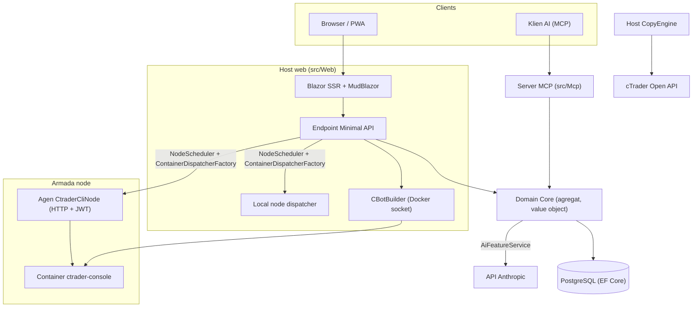

# Gambaran Arsitektur

cMind adalah platform **Blazor Server + Minimal API** multi-tenant untuk cTrader, dibangun dengan **.NET 10 /
C# 14**, EF Core + PostgreSQL, dan .NET Aspire, dengan server MCP dan inti AI. Platform ini mengikuti
**Domain-Driven Design yang ketat**: aturan bisnis hidup di agregat dan value object dalam `Core` yang murni,
dan segala sesuatu yang lain mengorkestrasi.

Halaman ini adalah peta. Untuk alasan *mengapa* di balik pilihan spesifik, lihat
[Architecture Decision Records](./adr/README.md).

## Modul

| Proyek | Tanggung Jawab |
|---|---|
| `src/Core` | Domain murni — entitas, agregat, value object, strong ID, domain event, antarmuka sisi Core. **Nol** dependensi infra (tidak ada EF/HttpClient/Docker/ASP.NET). |
| `src/Infrastructure` | EF Core + PostgreSQL, enkripsi DataProtection, klien GHCR, klien AI Anthropic, observability. |
| `src/Nodes` | Orkestrasi lintas-node — penjadwalan, dispatch, poller, background service. |
| `src/CtraderCliNode` | Agen node HTTP standalone di host jarak jauh (JWT-auth, tanpa shell). Menjalankan dan backtest cBot dengan menjalankan **cTrader CLI** di dalam container docker — dan akan mengoptimalkan juga, setelah cTrader CLI menambahkannya. |
| `src/CopyEngine` | Host copy-trading: mencerminkan perdagangan dari akun sumber ke tujuan. |
| `src/CTraderOpenApi` | Klien cTrader Open API (protobuf over TCP/SSL) — auth, trading session, equity. |
| `src/Web` | Blazor Server SSR + Minimal API + SignalR + MudBlazor UI. |
| `src/Mcp` | Server MCP HTTP+SSE yang mengekspos tools ke klien AI. |
| `src/AppHost` | Orkestraor .NET Aspire (Postgres, Web, MCP, pgAdmin). |

## Gambaran Besar

## Aliran Permintaan

### Build & Backtest

1. Pengguna mengirimkan proyek sumber cBot. `CBotBuilder` berjalan **di host web** (membutuhkan soket Docker) di dalam container SDK yang dapat dibuang dengan `/work` yang di-bind-mount dan volume `app-nuget-cache` bersama, sehingga MSBuild yang tidak terpercaya tidak dapat menjangkau filesystem atau jaringan host.
2. Container run/backtest dijalankan pada node yang dipilih oleh `NodeScheduler`, dikirimkan melalui `ContainerDispatcherFactory` → baik `Http` (agen `CtraderCliNode` jarak jauh) atau `Local` (node host web itu sendiri).
3. Container menjalankan `ghcr.io/spotware/ctrader-console` dengan `--exit-on-stop`. Poller (`RunCompletionPoller`, `BacktestCompletionPoller`) merekonsiliasi container yang keluar sendiri: exit 0/null ⇒ Stopped, non-zero ⇒ Failed.

State instansi adalah **TPH, dan transisi mengganti entitas** (diskriminator tidak dapat berubah), jadi **id instansi berubah** starting → running → terminal. **Container id stabil** dan dibawa ke depan; agen HTTP di-key oleh container id untuk status/report/stop/log.

### Node cTrader CLI

Node cTrader CLI tidak mendapat **SSH atau shell**. Aplikasi utama berbicara ke setiap agen melalui HTTP; setiap permintaan membawa **JWT** HS256 berumur pendek (5 menit, `iss=app-main` / `aud=app-node`) yang ditandatangani dengan secret node itu. Agen hanya menjalankan citra yang cocok dengan `AllowedImagePrefix`, exec docker melalui `ArgumentList` (tidak pernah shell), dan stateless (menemukan container berdasarkan label `app.instance`). Agen self-register dan heartbeat ke `POST /api/nodes/register`; aplikasi utama melakukan upsert `CtraderCliNode` **berdasarkan nama** sehingga bertahan melalui perubahan IP.

### Copy Trading

`CopyEngineSupervisor` (sebuah `BackgroundService`) merekonsiliasi profil copy yang berjalan dengan instansi `CopyEngineHost` live — mengklaim profil melalui atomic DB lease (sehingga dua node tidak pernah double-copy), memperbarui lease, dan memulai ulang host yang mati. Setiap `CopyEngineHost` terhubung ke cTrader Open API, mencerminkan eksekusi sumber ke tujuan melalui `CopyDecisionEngine` murni (filter arah/latensi/slippage + sizing), dan self-heal melalui resync + partial-fill true-up.

### AI

AI adalah **sepenuhnya gated pada `AppOptions.Ai.ApiKey`** — unset ⇒ setiap fitur mengembalikan `AiResult.Fail` dan aplikasi berjalan tidak berubah (tidak ada kunci yang diperlukan untuk build/test/E2E). `IAiClient` memanggil Anthropic melalui **HTTP raw** (sebuah `HttpClient` yang typed), sengaja bukan SDK. `AiFeatureService` adalah orkestraor tunggal yang dibagikan oleh endpoint Web, `AiTools` MCP, dan `AiRiskGuard`.

## Aturan Cross-Cutting

- **Satu `SaveChanges` memutasi satu agregat.** Aliran lintas-agregat menggunakan domain event yang dikirim oleh interceptor EF.
- **Agregat mereferensi satu sama lain berdasarkan strong ID**, tidak pernah property navigasi.
- **Tidak ada ambient clock.** Kode menginjeksi `TimeProvider`; metode domain mengambil `DateTimeOffset now`.
- **Secrets** dienkripsi melalui `ISecretProtector` (`EncryptionPurposes`); **strings** hidup di
  `Core/Constants/`; **logs** melalui `LogMessages` yang di-generate sumber.

Ini diberlakukan di CI: analyzer sweep, build zero-warning, dan `ArchitectureGuardTests` (yang mengalahkan build pada pembacaan ambient-clock, dependensi infra Core, atau panggilan langsung `ILogger.Log*`).
