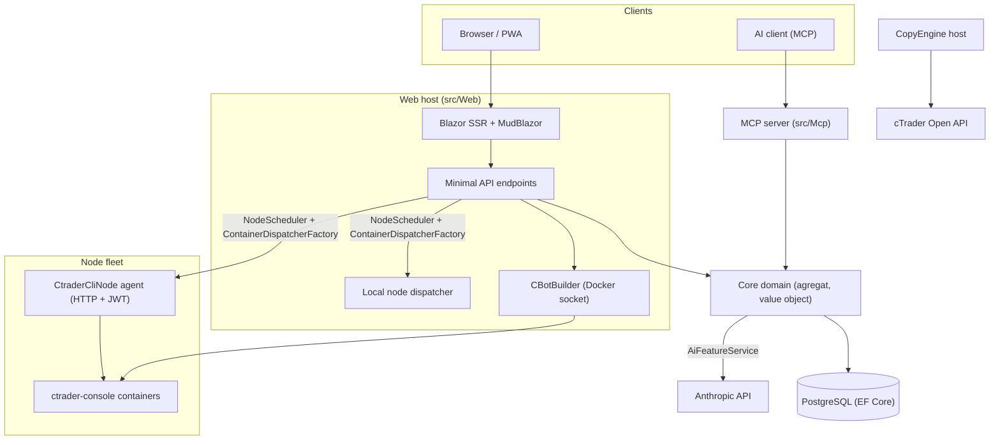

# Ringkasan arsitektur

cMind adalah platform multi-tenant **Blazor Server + Minimal API** untuk cTrader, dibangun di **.NET 10 / C# 14**, EF Core + PostgreSQL, dan .NET Aspire, dengan server MCP dan inti AI. Mengikuti **strict Domain-Driven Design**: aturan bisnis hidup pada agregat dan value object dalam `Core` murni, dan semuanya mengorkestra.

Halaman ini adalah peta. Untuk *mengapa* di balik pilihan spesifik, lihat [Architecture Decision Records](./adr/README.md).

## Modul

| Proyek | Tanggung Jawab |
|---|---|
| `src/Core` | Domain murni — entity, agregat, value object, strong ID, domain event, antarmuka Core-side. **Nol** ketergantungan infra (tidak ada EF/HttpClient/Docker/ASP.NET). |
| `src/Infrastructure` | EF Core + PostgreSQL, enkripsi DataProtection, klien GHCR, klien Anthropic AI, observability. |
| `src/Nodes` | Orchestration cross-node — scheduling, dispatch, poller, background service. |
| `src/CtraderCliNode` | Agent node HTTP standalone di host jarak jauh (JWT-auth, tanpa shell). Menjalankan dan backtest cBot dengan mengemudi **cTrader CLI** di dalam container docker — dan akan optimize juga, setelah cTrader CLI menambahkannya. |
| `src/CopyEngine` | Host copy-trading: mencerminkan perdagangan dari account source ke destination. |
| `src/CTraderOpenApi` | Klien cTrader Open API (protobuf over TCP/SSL) — auth, trading session, equity. |
| `src/Web` | Blazor Server SSR + Minimal API + SignalR + MudBlazor UI. |
| `src/Mcp` | Server MCP HTTP+SSE mengekspos tool ke klien AI. |
| `src/AppHost` | Orchestrator .NET Aspire (Postgres, Web, MCP, pgAdmin). |

## Gambaran besar

## Alur permintaan

### Build & backtest

1. Pengguna submit proyek source cBot. `CBotBuilder` berjalan **di web host** (itu butuh Docker socket) di dalam container SDK sekali pakai dengan `/work` bind-mounted dan volume `app-nuget-cache` bersama, jadi MSBuild tidak dipercaya tidak dapat mencapai filesystem atau jaringan host.
2. Container run/backtest mengeksekusi pada node yang dipilih oleh `NodeScheduler`, dispatched melalui `ContainerDispatcherFactory` → baik `Http` (agent `CtraderCliNode` jarak jauh) atau `Local` (node host web sendiri).
3. Container menjalankan `ghcr.io/spotware/ctrader-console` dengan `--exit-on-stop`. Poller (`RunCompletionPoller`, `BacktestCompletionPoller`) reconcile container yang self-exited: exit 0/null ⇒ Stopped, non-zero ⇒ Failed.

Status instance adalah **TPH, dan transisi mengganti entity** (discriminator tidak dapat berubah), jadi instance **id berubah** starting → running → terminal. **Container id stabil** dan dibawa over; agent HTTP dikunci oleh container id untuk status/report/stop/logs.

### Node CLI cTrader

Node CLI cTrader mendapat **tidak ada SSH atau shell**. Aplikasi utama berbicara ke setiap agent melalui HTTP; setiap permintaan membawa JWT **HS256** berumur pendek (5-menit, `iss=app-main` / `aud=app-node`) yang ditandatangani dengan rahasia node itu. Agent hanya menjalankan image yang cocok dengan `AllowedImagePrefix`, exec docker melalui `ArgumentList` (tidak pernah shell), dan stateless (menemukan container menurut label `app.instance`). Agent self-register dan heartbeat ke `POST /api/nodes/register`; aplikasi utama upsert `CtraderCliNode` **berdasarkan nama** sehingga bertahan perubahan IP.

### Copy trading

`CopyEngineSupervisor` (sebuah `BackgroundService`) reconcile running copy profile dengan live `CopyEngineHost` instance — mengklaim profil melalui atomic DB lease (sehingga dua node tidak pernah double-copy), renew lease, dan restart host mati. Setiap `CopyEngineHost` terhubung ke cTrader Open API, mencerminkan source execution ke destination melalui pure `CopyDecisionEngine` (filter direction/latency/slippage + sizing), dan self-heal via resync + partial-fill true-up.

### AI

AI adalah **fully gated di `AppOptions.Ai.ApiKey`** — unset ⇒ setiap fitur mengembalikan `AiResult.Fail` dan aplikasi berjalan tidak berubah (tidak ada kunci yang dibutuhkan untuk build/test/E2E). `IAiClient` memanggil Anthropic melalui **HTTP mentah** (sebuah typed `HttpClient`), deliberately bukan SDK. `AiFeatureService` adalah orchestrator tunggal yang dibagikan oleh endpoint Web, `AiTools` MCP, dan `AiRiskGuard`.

## Aturan cross-cutting

- **Satu `SaveChanges` memutasi satu agregat.** Alur cross-agregat menggunakan domain event yang didispatch oleh interceptor EF.
- **Agregat mereferensikan satu sama lain melalui strong ID**, tidak pernah navigation property.
- **Tidak ada ambient clock.** Kode inject `TimeProvider`; domain method ambil `DateTimeOffset now`.
- **Secrets** dienkripsi melalui `ISecretProtector` (`EncryptionPurposes`); **string** hidup di `Core/Constants/`; **logs** melalui source-generated `LogMessages`.

Ini ditegakkan di CI: analyzer sweep, zero-warning build, dan `ArchitectureGuardTests` (yang gagal build pada ambient-clock read, Core infra dependency, atau direct `ILogger.Log*` call).
