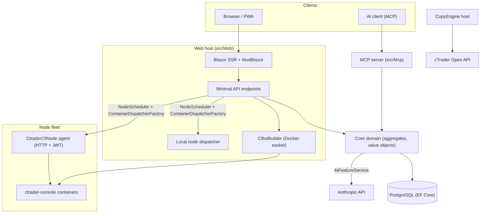

# Panoramica dell'architettura

cMind è una piattaforma multi-tenant **Blazor Server + Minimal API** per cTrader, costruita su **.NET 10 / C# 14**, EF Core + PostgreSQL e .NET Aspire, con un server MCP e un nucleo AI. Segue **Domain-Driven Design rigoroso**: le regole di business risiedono su aggregati e value object in un `Core` puro e tutto il resto orchestra.

Questa pagina è la mappa. Per il *perché* dietro scelte specifiche, vedi i [Architecture Decision Records](./adr/README.md).

## Moduli

| Progetto | Responsabilità |
|---|---|
| `src/Core` | Dominio puro — entità, aggregati, value object, ID forti, eventi di dominio, interfacce Core-side. **Zero** dipendenze infra (niente EF/HttpClient/Docker/ASP.NET). |
| `src/Infrastructure` | EF Core + PostgreSQL, crittografia DataProtection, client GHCR, client AI Anthropic, osservabilità. |
| `src/Nodes` | Orchestrazione cross-node — scheduling, dispatch, poller, background service. |
| `src/CtraderCliNode` | Agente nodo HTTP autonomo su host remoti (autenticazione JWT, niente shell). Esegue e backtesta cBot guidando il **cTrader CLI** all'interno di un contenitore docker — e ottimizzerà anche, una volta che cTrader CLI lo aggiungerà. |
| `src/CopyEngine` | L'host di copy-trading: rispecchia le operazioni da un account sorgente a destinazioni. |
| `src/CTraderOpenApi` | Client API cTrader Open (protobuf su TCP/SSL) — autenticazione, sessione di trading, patrimonio. |
| `src/Web` | Blazor Server SSR + Minimal API + SignalR + UI MudBlazor. |
| `src/Mcp` | Server MCP HTTP+SSE che espone strumenti ai client AI. |
| `src/AppHost` | Orchestratore .NET Aspire (Postgres, Web, MCP, pgAdmin). |

## Il quadro generale

## Flussi di richiesta

### Build & backtest

1. Un utente invia un progetto sorgente cBot. `CBotBuilder` viene eseguito **sull'host web** (ha bisogno del socket Docker) all'interno di un contenitore SDK monouso con un `/work` bind-montato e un volume `app-nuget-cache` condiviso, quindi MSBuild non attendibile non può raggiungere il filesystem dell'host o la rete.
2. I contenitori di esecuzione/backtest si eseguono su un nodo scelto da `NodeScheduler`, inviati attraverso `ContainerDispatcherFactory` → `Http` (un agente remoto `CtraderCliNode`) o `Local` (il nodo dell'host web).
3. I contenitori eseguono `ghcr.io/spotware/ctrader-console` con `--exit-on-stop`. I poller (`RunCompletionPoller`, `BacktestCompletionPoller`) riconciliano i contenitori auto-usciti: uscita 0/null ⇒ Stopped, non-zero ⇒ Failed.

Lo stato dell'istanza è **TPH, e una transizione sostituisce l'entità** (il discriminatore non può cambiare), quindi un **id dell'istanza cambia** starting → running → terminal. L'**id del contenitore è stabile** e portato avanti; l'agente HTTP è indexato per id del contenitore per status/report/stop/log.

### Nodi cTrader CLI

I nodi cTrader CLI non ricevono **niente SSH o shell**. L'app principale parla a ogni agente su HTTP; ogni richiesta porta un HS256 **JWT** di breve durata (5 minuti, `iss=app-main` / `aud=app-node`) firmato con il segreto di quel nodo. L'agente esegue solo immagini corrispondenti a `AllowedImagePrefix`, esegue docker tramite `ArgumentList` (mai una shell), ed è stateless (trova i contenitori per etichetta `app.instance`). Gli agenti si auto-registrano e inviano heartbeat a `POST /api/nodes/register`; l'app principale fa upsert del `CtraderCliNode` **per nome** quindi sopravvive ai cambiamenti IP.

### Copy trading

`CopyEngineSupervisor` (un `BackgroundService`) riconcilia i profili di copia in esecuzione con istanze `CopyEngineHost` attive — rivendicando profili tramite un lease DB atomico (quindi due nodi non copiano mai doppiamente), rinnovando lease e riavviando host morti. Ogni `CopyEngineHost` si connette all'API cTrader Open, rispecchia le esecuzioni sorgente sulle destinazioni attraverso il `CopyDecisionEngine` puro (filtri di direzione/latenza/slippage + sizing) e si auto-guarisce tramite resync + partial-fill true-up.

### AI

L'AI è **completamente gated su `AppOptions.Ai.ApiKey`** — impostato ⇒ ogni funzione restituisce `AiResult.Fail` e l'app viene eseguita invariata (nessuna chiave necessaria per build/test/E2E). `IAiClient` chiama Anthropic su **HTTP grezzo** (un `HttpClient` tipizzato), deliberatamente non l'SDK. `AiFeatureService` è il singolo orchestratore condiviso dai Web endpoint, dagli `AiTools` MCP e da `AiRiskGuard`.

## Regole cross-cutting

- **Un `SaveChanges` muta un aggregato.** I flussi cross-aggregate usano eventi di dominio inviati da un interceptor EF.
- **Gli aggregati si riferiscono l'uno all'altro per ID forte**, mai per proprietà di navigazione.
- **Nessun clock ambiente.** Il codice inietta `TimeProvider`; i metodi di dominio prendono un `DateTimeOffset now`.
- **I segreti** sono crittografati tramite `ISecretProtector` (`EncryptionPurposes`); le **stringhe** vivono in `Core/Constants/`; i **log** passano attraverso `LogMessages` generato da origine.

Questi vengono applicati in CI: la sweep dell'analizzatore, la build senza warning e `ArchitectureGuardTests` (che falliscono la build su una lettura dell'orologio ambiente, una dipendenza infra Core o una chiamata diretta a `ILogger.Log*`).
