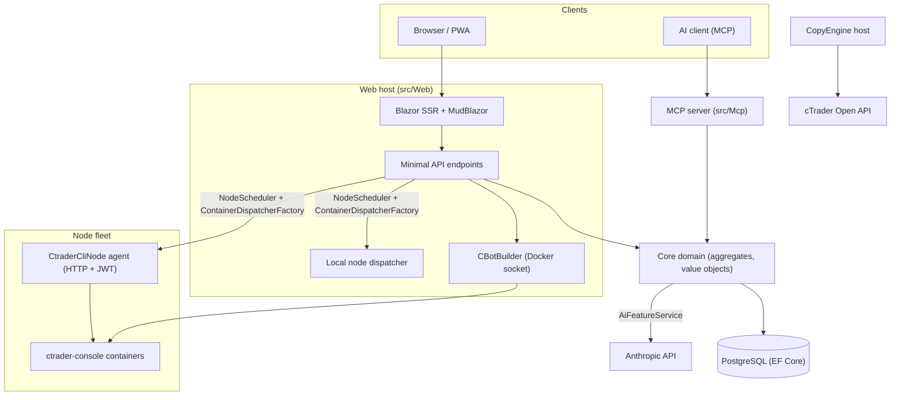

# アーキテクチャ概要

cMind は、**.NET 10 / C# 14**、EF Core + PostgreSQL、.NET Aspire、MCP サーバー、AI コアを基盤とした cTrader 向けのマルチテナント **Blazor Server + Minimal API** プラットフォームです。**厳密なドメイン駆動設計**に従い、ビジネスルールは純粋な `Core` 上のアグリゲートと値オブジェクト上に存在し、その他すべてはオーケストレーションします。

このページは地図です。特定の選択肢の背後にある*理由*については、
[アーキテクチャ決定記録](./adr/README.md)を参照してください。

## モジュール

| プロジェクト | 責務 |
|---|---|
| `src/Core` | 純粋なドメイン — エンティティ、アグリゲート、値オブジェクト、強型ID、ドメインイベント、Core側インターフェース。インフラストラクチャ依存なし（EF/HttpClient/Docker/ASP.NET なし）。 |
| `src/Infrastructure` | EF Core + PostgreSQL、DataProtection 暗号化、GHCR クライアント、Anthropic AI クライアント、可観測性。 |
| `src/Nodes` | ノード間オーケストレーション — スケジューリング、ディスパッチ、ポーラー、バックグラウンドサービス。 |
| `src/CtraderCliNode` | リモートホスト上のスタンドアロン HTTP ノードエージェント（JWT 認証、シェルなし）。**cTrader CLI** を Docker コンテナ内で駆動して cBot をビルドおよびバックテストします — cTrader CLI がサポートしたら最適化も行います。 |
| `src/CopyEngine` | コピートレード ホスト: ソースアカウントからのトレードをデスティネーションにミラーリングします。 |
| `src/CTraderOpenApi` | cTrader Open API クライアント（protobuf over TCP/SSL）— 認証、トレーディングセッション、エクイティ。 |
| `src/Web` | Blazor Server SSR + Minimal API + SignalR + MudBlazor UI。 |
| `src/Mcp` | MCP HTTP+SSE サーバーで AI クライアントにツールを公開します。 |
| `src/AppHost` | .NET Aspire オーケストレーター（Postgres、Web、MCP、pgAdmin）。 |

## 全体像

## リクエストフロー

### ビルドとバックテスト

1. ユーザーが cBot ソースプロジェクトを送信します。`CBotBuilder` はウェブホスト上で実行され（Docker ソケットが必要）、バインドマウントされた `/work` と共有 `app-nuget-cache` ボリュームを備えた一時的な SDK コンテナ内で実行されるため、信頼されていない MSBuild はホストファイルシステムまたはネットワークにアクセスできません。
2. 実行/バックテストコンテナは `NodeScheduler` で選択されたノードで実行され、`ContainerDispatcherFactory` を通じてディスパッチされます — `Http`（リモート `CtraderCliNode` エージェント）または `Local`（ウェブホストの独自ノード）のいずれか。
3. コンテナは `ghcr.io/spotware/ctrader-console` を `--exit-on-stop` で実行します。ポーラー（`RunCompletionPoller`、`BacktestCompletionPoller`）は自己終了コンテナと統調します: 終了コード 0/null ⇒ Stopped、0以外 ⇒ Failed。

インスタンス状態は **TPH** で、遷移によってエンティティが置き換わります（判別子は変更できません）。そのため、インスタンス **ID は変わります** starting → running → terminal。**コンテナ ID は安定**し、引き継がれます。HTTP エージェントはステータス/レポート/停止/ログのコンテナ ID でキーイングされます。

### cTrader CLI ノード

cTrader CLI ノードは **SSH やシェルを取得しません**。メインアプリは各エージェントと HTTP 経由で通信します。すべてのリクエストには短期間有効な HS256 **JWT**（5分間、`iss=app-main` / `aud=app-node`）が含まれており、そのノードのシークレットで署名されます。エージェントは `AllowedImagePrefix` にマッチするイメージのみを実行し、`ArgumentList` 経由で docker を実行します（シェルなし）。ステートレスです（`app.instance` ラベルでコンテナを検索）。エージェントは自己登録し、`POST /api/nodes/register` にハートビートを送信します。メインアプリはノード名で `CtraderCliNode` をアップサートするため、IP 変更後も存続します。

### コピートレード

`CopyEngineSupervisor`（`BackgroundService`）は実行中のコピープロファイルをライブ `CopyEngineHost` インスタンスと統調します — アトミック DB リース経由でプロファイルをクレーム（2 つのノードが二重コピーしないように）、リースを更新し、デッドホストを再起動します。各 `CopyEngineHost` は cTrader Open API に接続し、純粋な `CopyDecisionEngine`（方向/レイテンシ/スリップページフィルタ + サイジング）を通じてソース実行をデスティネーションにミラーリングし、リシンク + 部分的フィルアップにより自己回復します。

### AI

AI は **`AppOptions.Ai.ApiKey` で完全にゲート**されています — 未設定 ⇒ すべての機能が `AiResult.Fail` を返し、アプリは変わりなく実行されます（ビルド/テスト/E2E にはキーが必要ありません）。`IAiClient` は Anthropic に **raw HTTP**（型付き `HttpClient`）経由で呼び出し、意図的に SDK ではありません。`AiFeatureService` は Web エンドポイント、MCP `AiTools`、`AiRiskGuard` で共有される単一オーケストレーターです。

## 横断的なルール

- **1 つの `SaveChanges` は 1 つのアグリゲートを変更します。** クロスアグリゲートフローは EF インターセプターによってディスパッチされるドメインイベントを使用します。
- **アグリゲートは強型 ID で相互参照**し、ナビゲーションプロパティは参照しません。
- **アンビエント クロックなし。** コードは `TimeProvider` を注入します。ドメインメソッドは呼び出し元から `DateTimeOffset now` を取得します。
- **シークレット**は `ISecretProtector`（`EncryptionPurposes`）経由で暗号化されます。**文字列**は `Core/Constants/` に存在します。**ログ**はソースで生成された `LogMessages` を通じて渡されます。

これらは CI で実施されます: アナライザースイープ、ゼロ警告ビルド、および `ArchitectureGuardTests`（アンビエントクロック読み取り、Core インフラ依存、または直接 `ILogger.Log*` 呼び出しでビルドが失敗します）。
