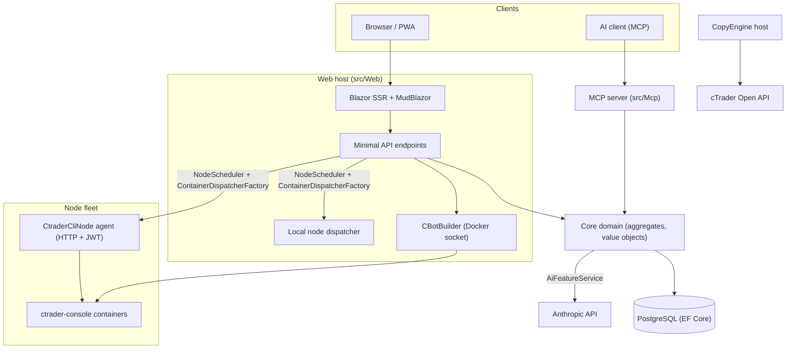

# 아키텍처 개요

cMind는 **.NET 10 / C# 14**를 기반으로 한 cTrader용 멀티테넌트 **Blazor Server + Minimal API** 플랫폼으로, EF Core + PostgreSQL, .NET Aspire, MCP 서버 및 AI 코어를 함께 사용합니다. **엄격한 도메인 주도 설계(DDD)** 를 따릅니다: 비즈니스 규칙은 순수 `Core`의 애그리게이트 및 값 객체에 있고, 다른 모든 것은 오케스트레이션합니다.

이 페이지가 맵입니다. 특정 선택이 왜 이루어졌는지 자세히 알려면,
[아키텍처 결정 기록](./adr/README.md)을 참조하세요.

## 모듈

| 프로젝트 | 책임 |
|---|---|
| `src/Core` | 순수 도메인 — 엔티티, 애그리게이트, 값 객체, 강한 ID, 도메인 이벤트, Core 측 인터페이스. **0개의** 인프라 의존성(EF/HttpClient/Docker/ASP.NET 없음). |
| `src/Infrastructure` | EF Core + PostgreSQL, DataProtection 암호화, GHCR 클라이언트, Anthropic AI 클라이언트, 관찰성. |
| `src/Nodes` | 교차 노드 오케스트레이션 — 스케줄링, 디스패치, 폴러, 백그라운드 서비스. |
| `src/CtraderCliNode` | 원격 호스트의 독립형 HTTP 노드 에이전트(JWT 인증, 셸 없음). **cTrader CLI**를 docker 컨테이너 내에서 구동하여 cBot을 실행 및 백테스트하고, cTrader CLI가 지원하면 최적화도 할 예정. |
| `src/CopyEngine` | 복사 거래 호스트: 소스 계정에서 대상으로 거래를 미러링. |
| `src/CTraderOpenApi` | cTrader Open API 클라이언트(protobuf over TCP/SSL) — 인증, 거래 세션, 자산. |
| `src/Web` | Blazor Server SSR + Minimal API + SignalR + MudBlazor UI. |
| `src/Mcp` | AI 클라이언트에 도구를 노출하는 MCP HTTP+SSE 서버. |
| `src/AppHost` | .NET Aspire 오케스트레이터(Postgres, Web, MCP, pgAdmin). |

## 전체 그림

## 요청 흐름

### 빌드 & 백테스트

1. 사용자가 cBot 소스 프로젝트를 제출합니다. `CBotBuilder`는 **웹 호스트에서 실행되며**(Docker 소켓이 필요합니다) `/work`가 bind-mounted된 일회용 SDK 컨테이너 내에서 실행되고 `app-nuget-cache` 볼륨을 공유하므로 신뢰할 수 없는 MSBuild는 호스트 파일 시스템이나 네트워크에 접근할 수 없습니다.
2. 실행/백테스트 컨테이너는 `NodeScheduler`가 선택한 노드에서 실행되며, `ContainerDispatcherFactory`를 통해 디스패치됩니다 → `Http`(원격 `CtraderCliNode` 에이전트) 또는 `Local`(웹 호스트의 자체 노드).
3. 컨테이너는 `ghcr.io/spotware/ctrader-console`에서 `--exit-on-stop`과 함께 실행됩니다. 폴러(`RunCompletionPoller`, `BacktestCompletionPoller`)가 자체 종료 컨테이너를 조정합니다: exit 0/null ⇒ Stopped, 0 이외 ⇒ Failed.

인스턴스 상태는 **TPH이며, 전환이 엔티티를 교체합니다**(판별식은 변경될 수 없음), 따라서 인스턴스 **id는 변경됩니다** starting → running → terminal. **컨테이너 id는 안정적**이며 이월됩니다; HTTP 에이전트는 상태/보고서/중지/로그에 대해 컨테이너 id로 키가 지정됩니다.

### cTrader CLI 노드

cTrader CLI 노드는 **SSH나 셸을 갖지 않습니다**. 메인 앱은 각 에이전트와 HTTP를 통해 통신합니다; 모든 요청은 해당 노드의 비밀로 서명된 단기 HS256 **JWT**(5분, `iss=app-main` / `aud=app-node`)를 전달합니다. 에이전트는 `AllowedImagePrefix`와 일치하는 이미지만 실행하며, `ArgumentList`를 통해 docker을 실행하고(셸 없음), 상태 비저장입니다(`app.instance` 레이블로 컨테이너를 찾습니다). 에이전트는 자체 등록되고 `POST /api/nodes/register`로 하트비트합니다; 메인 앱은 `CtraderCliNode`를 **이름으로** upserts하므로 IP 변경 시에도 유지됩니다.

### 복사 거래

`CopyEngineSupervisor`(하나의 `BackgroundService`)는 실행 중인 복사 프로필을 실시간 `CopyEngineHost` 인스턴스와 조정합니다 — 원자적 DB 리스를 통해 프로필을 청구합니다(두 노드가 중복 복사하지 않음), 리스를 갱신하고, 죽은 호스트를 재시작합니다. 각 `CopyEngineHost`는 cTrader Open API에 연결되고, 순수 `CopyDecisionEngine`(방향/레이턴시/슬리피지 필터 + 사이징)을 통해 소스 실행을 대상으로 미러링하며, resync + partial-fill true-up을 통해 자체 치유됩니다.

### AI

AI는 **`AppOptions.Ai.ApiKey`에 대해 완전히 게이트됩니다** — 미설정 ⇒ 모든 기능이 `AiResult.Fail`을 반환하고 앱은 변경되지 않습니다(빌드/테스트/E2E에는 키가 필요하지 않음). `IAiClient`는 **raw HTTP**(typed `HttpClient`)를 통해 Anthropic을 호출하며, 의도적으로 SDK를 사용하지 않습니다. `AiFeatureService`는 Web 엔드포인트, MCP `AiTools`, `AiRiskGuard`를 통해 공유되는 단일 오케스트레이터입니다.

## 교차 절단 규칙

- **하나의 `SaveChanges`는 하나의 애그리게이트를 변경합니다.** 교차 애그리게이트 흐름은 EF 인터셉터에 의해 디스패치된 도메인 이벤트를 사용합니다.
- **애그리게이트는 강한 ID로 서로를 참조합니다**, 네비게이션 프로퍼티가 아닙니다.
- **앰비언트 클록이 없습니다.** 코드는 `TimeProvider`를 주입합니다; 도메인 메서드는 `DateTimeOffset now`를 취합니다.
- **비밀**은 `ISecretProtector`(`EncryptionPurposes`)를 통해 암호화됩니다; **문자열**은 `Core/Constants/`에 있습니다; **로그**는 소스 생성 `LogMessages`를 통해 진행됩니다.

이들은 CI에서 시행됩니다: 분석기 스윕, zero-warning 빌드, `ArchitectureGuardTests`(앰비언트 클록 읽기, Core 인프라 의존성, 또는 직접 `ILogger.Log*` 호출 시 빌드 실패).
