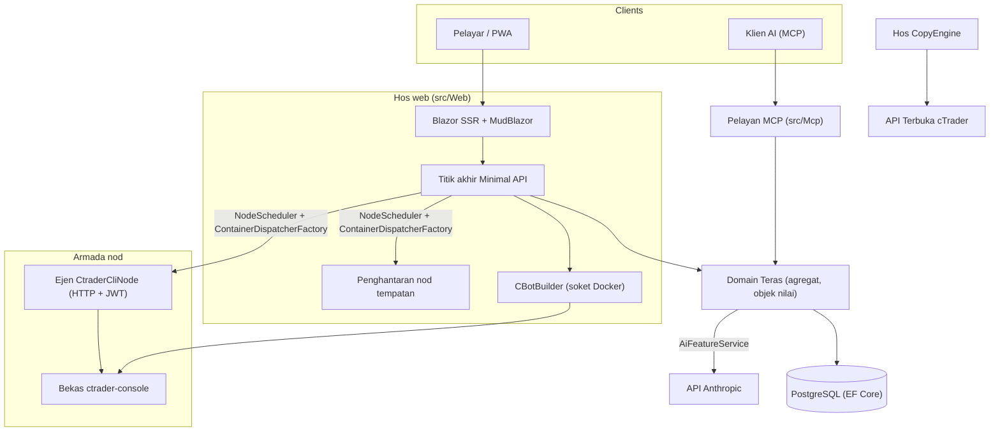

# Gambaran keseluruhan seni bina

cMind adalah platform **Blazor Server + Minimal API** berbilang penyewa untuk cTrader, yang dibina di atas **.NET 10 /
C# 14**, EF Core + PostgreSQL, dan .NET Aspire, dengan pelayan MCP dan inti AI. Ia mengikut
**Reka Bentuk Berorientasikan Domain yang ketat**: peraturan perniagaan hidup di agregat dan objek nilai dalam
`Core` tulen, dan segala-galanya mengorkestrasikan.

Halaman ini adalah peta. Untuk *sebab* di sebalik pilihan khusus, lihat
[Rekod Keputusan Seni Bina](./adr/README.md).

## Modul-modul

| Projek | Tanggungjawab |
|---|---|
| `src/Core` | Domain tulen — entiti, agregat, objek nilai, ID kuat, peristiwa domain, antara muka pihak Teras. **Sifar** kebergantungan infra (tiada EF/HttpClient/Docker/ASP.NET). |
| `src/Infrastructure` | EF Core + PostgreSQL, enkripsi DataProtection, klien GHCR, klien AI Anthropic, kebolehmataan. |
| `src/Nodes` | Orkestrasi lintas nod — penjadualan, penghantaran, pengundi, perkhidmatan latar belakang. |
| `src/CtraderCliNode` | Ejen nod HTTP berasingan pada hos jauh (JWT-auth, tiada cangkul). Menjalankan dan menguji cBots dengan memacu **CLI cTrader** di dalam bekas docker — dan akan mengoptimum juga, setelah CLI cTrader menambahnya. |
| `src/CopyEngine` | Hos salinan perdagangan: mencerminkan dagangan daripada akaun sumber ke destinasi. |
| `src/CTraderOpenApi` | Klien API Terbuka cTrader (protobuf melalui TCP/SSL) — auth, sesi perdagangan, ekuiti. |
| `src/Web` | Blazor Server SSR + Minimal API + SignalR + UI MudBlazor. |
| `src/Mcp` | Pelayan MCP HTTP+SSE yang menunjukkan alat kepada klien AI. |
| `src/AppHost` | Orkestrasi .NET Aspire (Postgres, Web, MCP, pgAdmin). |

## Gambaran besar

## Aliran permintaan

### Binaan & ujian belakang

1. Pengguna menyerahkan projek sumber cBot. `CBotBuilder` berjalan **di hos web** (ia memerlukan soket
   Docker) di dalam bekas SDK yang boleh dilupakan dengan `/work` yang diikat dan volum
   `app-nuget-cache` bersama, jadi MSBuild yang tidak dipercayai tidak dapat mencapai sistem fail atau rangkaian hos.
2. Bekas jalankan/ujian belakang dilaksanakan pada nod yang dipilih oleh `NodeScheduler`, dihantar melalui
   `ContainerDispatcherFactory` → sama ada `Http` (ejen `CtraderCliNode` jauh) atau `Local` (nod hos web sendiri).
3. Bekas menjalankan `ghcr.io/spotware/ctrader-console` dengan `--exit-on-stop`. Pengundi
   (`RunCompletionPoller`, `BacktestCompletionPoller`) menyelaraskan bekas yang berhenti sendiri: keluar 0/null
   ⇒ Dihentikan, bukan sifar ⇒ Gagal.

Keadaan contoh adalah **TPH, dan peralihan menggantikan entiti** (pembeza tidak boleh berubah), jadi
sebuah contoh **id berubah** bermula → berjalan → terminal. **ID bekas adalah stabil** dan dibawa
ke atas; ejen HTTP dikunci oleh id bekas untuk status/laporan/henti/log.

### Nod CLI cTrader

Nod CLI cTrader tidak mendapat **SSH atau cangkul**. Aplikasi utama bercakap kepada setiap ejen melalui HTTP; setiap permintaan
membawa JWT **5-minit** yang singkat HS256 (`iss=app-main` / `aud=app-node`) yang ditandatangani dengan
rahsia nod itu. Ejen hanya menjalankan imej yang sepadan dengan `AllowedImagePrefix`, eksek docker melalui
`ArgumentList` (tidak pernah cangkul), dan tanpa keadaan (ia menemui bekas dengan label `app.instance`).
Ejen mendaftar sendiri dan denyut nadi kepada `POST /api/nodes/register`; aplikasi utama membuat nilai
`CtraderCliNode` **mengikut nama** jadi ia bertahan perubahan IP.

### Salinan perdagangan

`CopyEngineSupervisor` (a `BackgroundService`) menyelaraskan profil salinan yang berjalan dengan direktif hidup
Contoh `CopyEngineHost` — menuntut profil melalui pajakan DB atom (jadi dua nod tidak pernah
menyalin dua kali), memperbaharui pajakan, dan memulai semula hos mati. Setiap `CopyEngineHost` menyambung ke
API Terbuka cTrader, mencerminkan pelaksanaan sumber ke destinasi melalui `CopyDecisionEngine` tulen
(penapis arah/kependaman/gelincir + saiz), dan penyembuhan sendiri melalui penyegerakan semula + penyempurna pengisian separa.

### AI

AI adalah **sepenuhnya bergantung pada `AppOptions.Ai.ApiKey`** — tidak ditetapkan ⇒ setiap fitur mengembalikan `AiResult.Fail` dan
aplikasi berjalan tanpa perubahan (tiada kunci diperlukan untuk binaan/ujian/E2E). `IAiClient` memanggil Anthropic melalui **HTTP tulen**
(a `HttpClient` taip), sengaja bukan SDK. `AiFeatureService` adalah orkestrasi tunggal
yang dikongsi oleh titik akhir Web, `AiTools` MCP, dan `AiRiskGuard`.

## Peraturan merentasi potong

- **Satu `SaveChanges` mengubah satu agregat.** Aliran lintas agregat menggunakan peristiwa domain yang dihantar oleh
  pencegat EF.
- **Agregat merujuk satu sama lain dengan ID kuat**, tidak pernah harta navigasi.
- **Tiada jam ambien.** Kod menyuntik `TimeProvider`; kaedah domain mengambil `DateTimeOffset now`.
- **Rahsia** dienkripsi melalui `ISecretProtector` (`EncryptionPurposes`); **rentetan** hidup dalam
  `Core/Constants/`; **log** melalui `LogMessages` yang dijana sumber.

Ini dikuatkuasakan dalam CI: sapuan penganalisis, pembinaan sifar-amaran, dan
`ArchitectureGuardTests` (yang gagal pembinaan pada bacaan jam ambien, kebergantungan infra Teras, atau
panggilan `ILogger.Log*` langsung).
