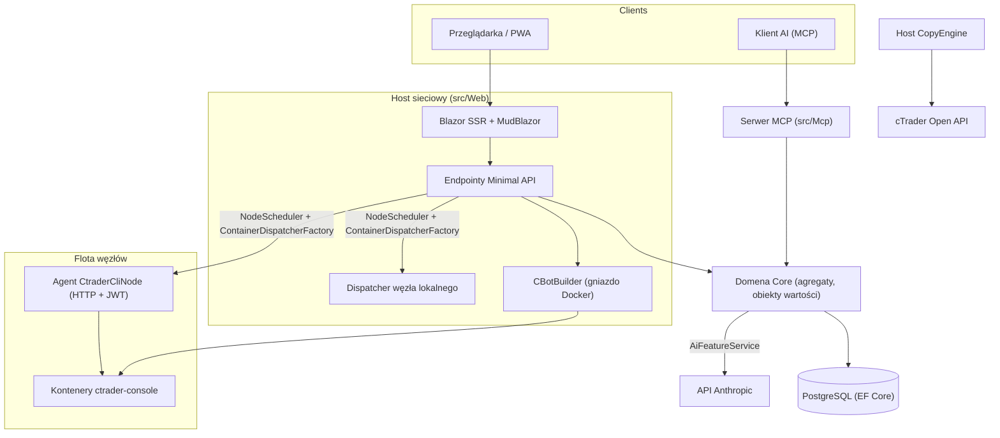

# Przegląd architektury

cMind to platforma wielodostępna **Blazor Server + Minimal API** dla cTrader, zbudowana na **.NET 10 / C# 14**, EF Core + PostgreSQL i .NET Aspire, z serwerem MCP i rdzeniem AI. Podąża za **ścisłym Domain-Driven Design**: reguły biznesowe żyją na agregatach i obiektach wartości w czystym `Core`, a wszystko inne orkiestruje.

Ta strona jest mapą. Dla *dlaczego* za konkretnymi wyborami, zobacz [Architecture Decision Records](./adr/README.md).

## Moduły

| Projekt | Odpowiedzialność |
|---|---|
| `src/Core` | Czista domena — encje, agregaty, obiekty wartości, silne ID, zdarzenia domenowe, interfejsy po stronie Core. **Zero** zależności infra (bez EF/HttpClient/Docker/ASP.NET). |
| `src/Infrastructure` | EF Core + PostgreSQL, szyfrowanie DataProtection, klient GHCR, klient AI Anthropic, obserwowanie. |
| `src/Nodes` | Orkiestracja między węzłami — planowanie, wysyłka, pollers, usługi w tle. |
| `src/CtraderCliNode` | Samodzielny agent HTTP na hostach zdalnych (uwierzytelnianie JWT, brak shell). Uruchamia i testuje cBoty, uruchamiając **cTrader CLI** wewnątrz kontenera docker — i będzie optymalizować też, kiedy cTrader CLI go doda. |
| `src/CopyEngine` | Host kopiowania transakcji: lustrzany transakcje ze źródłowego konta na konta docelowe. |
| `src/CTraderOpenApi` | Klient cTrader Open API (protobuf przez TCP/SSL) — uwierzytelnianie, sesja handlu, kapitał. |
| `src/Web` | Blazor Server SSR + Minimal API + SignalR + MudBlazor UI. |
| `src/Mcp` | Serwer MCP HTTP+SSE udostępniający narzędzia klientom AI. |
| `src/AppHost` | Orkiestrator .NET Aspire (Postgres, Web, MCP, pgAdmin). |

## Duży obraz

## Przepływy żądań

### Kompilacja i backtest

1. Użytkownik przedłoża projekt źródłowy cBota. `CBotBuilder` uruchamia się **na hoście sieciowym** (potrzebuje gniazda Docker) wewnątrz jednorazowego kontenera SDK z bind-mounted `/work` i wspólnym wolumenem `app-nuget-cache`, aby niezaufane MSBuild nie mogło osiągnąć system plików hosta lub sieć.
2. Kontenery uruchomienia/backtestu są wykonywane na węźle wybranym przez `NodeScheduler`, wysyłane przez `ContainerDispatcherFactory` → albo `Http` (agent zdalny `CtraderCliNode`) albo `Local` (węzeł samego hosta sieciowego).
3. Kontenery uruchamiają `ghcr.io/spotware/ctrader-console` z `--exit-on-stop`. Pollers (`RunCompletionPoller`, `BacktestCompletionPoller`) pogodzić samozamykające się kontenery: wyjście 0/null ⇒ Zatrzymane, niezerowe ⇒ Nieudane.

Stan instancji to **TPH i przejście zastępuje encję** (dyskryminatora nie można zmienić), więc **identyfikator instancji zmienia się** uruchamianie → bieganie → terminal. **Identyfikator kontenera jest stabilny** i jest przenoszony; agent HTTP jest indeksowany przez identyfikator kontenera dla statusu/raportu/zatrzymania/dzienników.

### Węzły cTrader CLI

Węzły cTrader CLI nie mają **SSH lub shell**. Główna aplikacja rozmawia z każdym agentem przez HTTP; każde żądanie nosi krótkotrwały HS256 **JWT** (5 minut, `iss=app-main` / `aud=app-node`) podpisany tajemnicą tego węzła. Agent tylko uruchamia obrazy pasujące do `AllowedImagePrefix`, wykonuje docker przez `ArgumentList` (nigdy shell) i jest bezstanowy (znajduje kontenery przez etykietę `app.instance`). Agenci się samodzielnie rejestrują i biją serce do `POST /api/nodes/register`; główna aplikacja upserta `CtraderCliNode` **po nazwie**, aby przetrwał zmiany IP.

### Kopiowanie transakcji

`CopyEngineSupervisor` (a `BackgroundService`) pogodzić biegające profile kopii z żywymi instancjami `CopyEngineHost` — żądanie profili przez atomowy leasing bazy danych (więc dwa węzły nigdy nie robią kopii dwa razy), odnawianie leasingów i ponowne uruchamianie martwych hostów. Każdy `CopyEngineHost` łączy się z cTrader Open API, lustrzane są wykonania źródłowe na docelach przez czysty `CopyDecisionEngine` (kierunek/opóźnienie/poślizgi filtry + rozmiar) i samo się leczy przez resync + utrwalanie częściowe wypełnienie.

### AI

AI jest **w pełni zależne od `AppOptions.Ai.ApiKey`** — bez ustawienia ⇒ każda funkcja zwraca `AiResult.Fail` i aplikacja działa bez zmian (brak klucza potrzebnego do kompilacji/testu/E2E). `IAiClient` wywoła Anthropic przez **surowy HTTP** (typowy `HttpClient`), świadomie nie SDK. `AiFeatureService` jest pojedynczym orkiestratorem współdzielonym przez endpointy sieciowe, `AiTools` MCP i `AiRiskGuard`.

## Reguły krzyżujące się

- **Jeden `SaveChanges` mutuje jeden agregat.** Przepływy między agregatami używają zdarzeń domenowych wysyłanych przez interceptor EF.
- **Agregaty odwołują się do siebie przez silne ID**, nigdy właściwość nawigacyjną.
- **Bez zegara otoczenia.** Kod wtryskuje `TimeProvider`; metody domenowe przyjmują `DateTimeOffset now`.
- **Sekrety** są szyfrowane przez `ISecretProtector` (`EncryptionPurposes`); **ciągi** żyją w `Core/Constants/`; **dzienniki** przechodzą przez generowane źródło `LogMessages`.

Są egzekwowane w CI: przeszukiwanie analizatora, kompilacja bez ostrzeżeń i `ArchitectureGuardTests` (które nie przebą kompilacji na czytaniu zegara otoczenia, zależności infra Core lub bezpośrednim wywołaniu `ILogger.Log*`).
