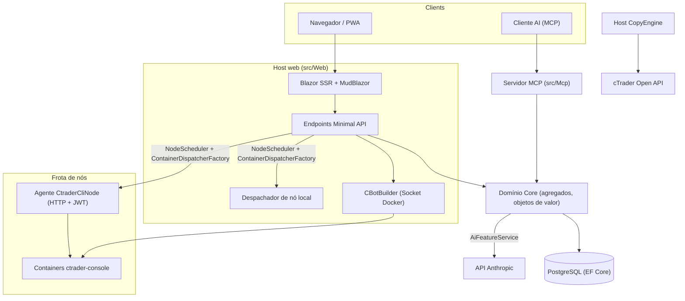

# Visão geral da arquitetura

cMind é uma plataforma multi-tenant **Blazor Server + Minimal API** para cTrader, construída em **.NET 10 / C# 14**, EF Core + PostgreSQL e .NET Aspire, com um servidor MCP e um núcleo de AI. Segue **Strict Domain-Driven Design**: regras de negócio vivem em agregados e objetos de valor em um `Core` puro, e tudo mais orquestra.

Esta página é o mapa. Para o *porquê* por trás de escolhas específicas, veja os [Registros de Decisão Arquitetural](./adr/README.md).

## Módulos

| Projeto | Responsabilidade |
|---|---|
| `src/Core` | Domínio puro — entidades, agregados, objetos de valor, strong IDs, eventos de domínio, interfaces do lado do Core. **Zero** dependências de infra (sem EF/HttpClient/Docker/ASP.NET). |
| `src/Infrastructure` | EF Core + PostgreSQL, criptografia DataProtection, cliente GHCR, cliente Anthropic AI, observabilidade. |
| `src/Nodes` | Orquestração entre nós — agendamento, despacho, pollers, serviços de background. |
| `src/CtraderCliNode` | Agente HTTP autônomo em hosts remotos (auth JWT, sem shell). Executa e backtests cBots dirigindo o **cTrader CLI** dentro de um container docker — e otimizará também, uma vez que o cTrader CLI adicione isso. |
| `src/CopyEngine` | O host de copy-trading: espelha negociações de uma conta de origem para destinos. |
| `src/CTraderOpenApi` | Cliente cTrader Open API (protobuf sobre TCP/SSL) — auth, sessão de trading, equity. |
| `src/Web` | Blazor Server SSR + Minimal API + SignalR + UI MudBlazor. |
| `src/Mcp` | Servidor MCP HTTP+SSE expondo ferramentas para clientes AI. |
| `src/AppHost` | Orquestrador .NET Aspire (Postgres, Web, MCP, pgAdmin). |

## O panorama geral

## Fluxos de solicitação

### Build e backtest

1. Um usuário envia um projeto de origem cBot. `CBotBuilder` roda **no host web** (precisa do socket Docker) dentro de um container SDK descartável com um `/work` bind-montado e um volume compartilhado `app-nuget-cache`, então MSBuild não confiável não pode alcançar o filesystem ou rede do host.
2. Containers de execução/backtest executam em um nó escolhido por `NodeScheduler`, despachados através de `ContainerDispatcherFactory` → seja `Http` (um agente remoto `CtraderCliNode`) ou `Local` (o próprio nó do host web).
3. Containers executam `ghcr.io/spotware/ctrader-console` com `--exit-on-stop`. Pollers (`RunCompletionPoller`, `BacktestCompletionPoller`) reconciliam containers auto-exits: exit 0/null ⇒ Stopped, não-zero ⇒ Failed.

O estado da instância é **TPH, e uma transição substitui a entidade** (o discriminador não pode mudar), então a **id da instância muda** starting → running → terminal. A **id do container é estável** e transportada; o agente HTTP é keyed pela id do container para status/relatório/parar/logs.

### Nós cTrader CLI

Nós cTrader CLI não têm **SSH ou shell**. A aplicação principal fala com cada agente sobre HTTP; cada solicitação carrega um **JWT** HS256 de curta vida (5 minutos, `iss=app-main` / `aud=app-node`) assinado com o segredo daquele nó. O agente executa apenas imagens correspondentes a `AllowedImagePrefix`, executa docker via `ArgumentList` (nunca um shell) e é stateless (encontra containers pelo rótulo `app.instance`). Agentes auto-registram e fazem heartbeat para `POST /api/nodes/register`; a aplicação principal faz upsert do `CtraderCliNode` **por nome** para que sobreviva a mudanças de IP.

### Copy trading

`CopyEngineSupervisor` (um `BackgroundService`) reconcilia perfis de cópia em execução com instâncias de `CopyEngineHost` ao vivo — reivindicando perfis através de um lease atômico de DB (para que dois nós nunca façam double-copy), renovando leases e reiniciando hosts mortos. Cada `CopyEngineHost` conecta à cTrader Open API, espelha execuções de origem para destinos através do puro `CopyDecisionEngine` (filtros de direção/latência/slippage + sizing) e auto-cura via resync + true-up de preenchimento parcial.

### AI

AI é **totalmente controlado por `AppOptions.Ai.ApiKey`** — não definido ⇒ cada recurso retorna `AiResult.Fail` e a aplicação roda sem alterações (nenhuma chave necessária para build/teste/E2E). `IAiClient` chama Anthropic através de **HTTP bruto** (um `HttpClient` tipado), deliberadamente não o SDK. `AiFeatureService` é o único orquestrador compartilhado por endpoints Web, as `AiTools` MCP e `AiRiskGuard`.

## Regras transversais

- **Um `SaveChanges` muta um agregado.** Fluxos entre agregados usam eventos de domínio despachados por um interceptor EF.
- **Agregados referenciam um ao outro por strong ID**, nunca propriedade de navegação.
- **Sem relógio ambiente.** Código injeta `TimeProvider`; métodos de domínio recebem um `DateTimeOffset now`.
- **Segredos** são criptografados via `ISecretProtector` (`EncryptionPurposes`); **strings** vivem em `Core/Constants/`; **logs** vão através de `LogMessages` gerados por fonte.

Estes são aplicados em CI: a varredura do analisador, a compilação zero-warning e `ArchitectureGuardTests` (que falham na compilação em uma leitura de relógio ambiente, uma dependência de infra Core ou uma chamada direta `ILogger.Log*`).
