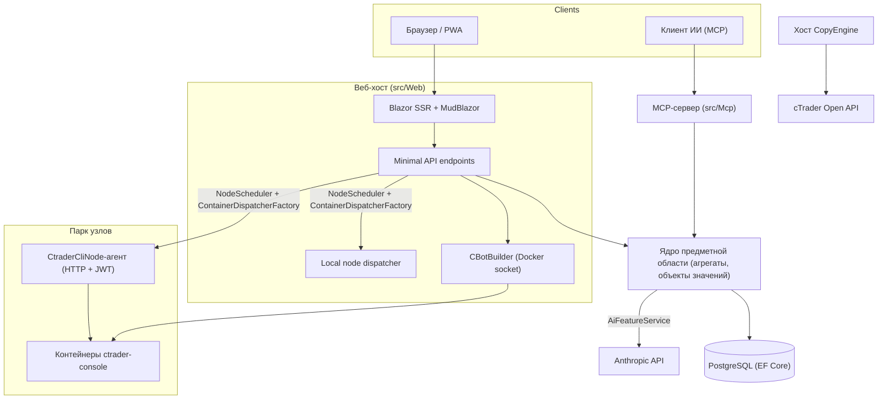

# Обзор архитектуры

cMind — это мультитенантная платформа **Blazor Server + Minimal API** для cTrader, построенная на **.NET 10 / C# 14**, EF Core + PostgreSQL и .NET Aspire, с MCP-сервером и ядром ИИ. Она следует **строгому Domain-Driven Design**: бизнес-правила живут на агрегатах и объектах значений в чистом `Core`, и всё остальное их координирует.

Эта страница — карта. Для *почему* стоит за конкретными выборами смотрите [Записи решений архитектуры](./adr/README.md).

## Модули

| Проект | Ответственность |
|---|---|
| `src/Core` | Чистая предметная область — сущности, агрегаты, объекты значений, строгие идентификаторы, события предметной области, интерфейсы на стороне Core. **Ноль** зависимостей инфраструктуры (нет EF/HttpClient/Docker/ASP.NET). |
| `src/Infrastructure` | EF Core + PostgreSQL, шифрование DataProtection, клиент GHCR, клиент ИИ Anthropic, наблюдаемость. |
| `src/Nodes` | Координация между узлами — планирование, отправка, опрос, фоновые сервисы. |
| `src/CtraderCliNode` | Автономный HTTP-агент узла на удаленных хостах (JWT-аутентификация, нет shell). Запускает и выполняет бэктесты cBots, управляя **cTrader CLI** внутри контейнера docker — и также оптимизирует, когда cTrader CLI это поддерживает. |
| `src/CopyEngine` | Хост копирования торговли: отражает сделки с исходного счета на целевые счета. |
| `src/CTraderOpenApi` | Клиент cTrader Open API (protobuf через TCP/SSL) — аутентификация, сессия торговли, капитал. |
| `src/Web` | Blazor Server SSR + Minimal API + SignalR + MudBlazor UI. |
| `src/Mcp` | MCP HTTP+SSE-сервер, предоставляющий инструменты клиентам ИИ. |
| `src/AppHost` | Оркестратор .NET Aspire (Postgres, Web, MCP, pgAdmin). |

## Общая картина

## Потоки запросов

### Сборка и бэктестирование

1. Пользователь отправляет исходный проект cBot. `CBotBuilder` работает **на веб-хосте** (ему нужен сокет Docker) внутри одноразового контейнера SDK с привязанным `/work` и общим томом `app-nuget-cache`, поэтому ненадёжный MSBuild не может получить доступ к файловой системе или сети хоста.
2. Контейнеры запуска/бэктеста выполняются на узле, выбранном `NodeScheduler`, отправленном через `ContainerDispatcherFactory` → либо `Http` (удаленный агент `CtraderCliNode`), либо `Local` (собственный узел веб-хоста).
3. Контейнеры запускают `ghcr.io/spotware/ctrader-console` с `--exit-on-stop`. Опросчики (`RunCompletionPoller`, `BacktestCompletionPoller`) согласовывают само-завершающиеся контейнеры: выход 0/null ⇒ Остановлено, ненулевой ⇒ Ошибка.

Состояние экземпляра **TPH, и переход заменяет сущность** (дискриминатор не может измениться), поэтому **идентификатор экземпляра изменяется** starting → running → terminal. **Идентификатор контейнера стабилен** и переносится; HTTP-агент индексируется по идентификатору контейнера для статуса/отчета/остановки/логов.

### Узлы cTrader CLI

Узлы cTrader CLI получают **нет SSH и shell**. Основное приложение общается с каждым агентом через HTTP; каждый запрос содержит краткоживущий HS256 **JWT** (5 минут, `iss=app-main` / `aud=app-node`), подписанный секретом того узла. Агент запускает только образы, соответствующие `AllowedImagePrefix`, выполняет docker через `ArgumentList` (никогда shell), и не имеет состояния (он находит контейнеры по метке `app.instance`). Агенты самостоятельно регистрируются и отправляют сердцебиение на `POST /api/nodes/register`; основное приложение обновляет `CtraderCliNode` **по имени**, чтобы пережить изменения IP.

### Копирование торговли

`CopyEngineSupervisor` (a `BackgroundService`) согласовывает работающие профили копирования с живыми экземплярами `CopyEngineHost` — захватывая профили через атомарную аренду БД (поэтому два узла никогда не копируют дважды), возобновляя аренды и перезапуская мертвые хосты. Каждый `CopyEngineHost` подключается к cTrader Open API, отражает исходные выполнения на целевые через чистый `CopyDecisionEngine` (фильтры направления/задержки/проскальзывания + размер), и самовосстанавливается через повторную синхронизацию + подтверждение частичного заполнения.

### ИИ

ИИ **полностью привязан к `AppOptions.Ai.ApiKey`** — не установлен ⇒ каждая функция возвращает `AiResult.Fail` и приложение работает без изменений (ключ не требуется для сборки/теста/E2E). `IAiClient` вызывает Anthropic через **сырой HTTP** (типизированный `HttpClient`), намеренно не SDK. `AiFeatureService` — единственный оркестратор, используемый веб-конечными точками, MCP `AiTools` и `AiRiskGuard`.

## Кросс-функциональные правила

- **Один `SaveChanges` мутирует один агрегат.** Кросс-агрегатные потоки используют события предметной области, отправленные интерцептором EF.
- **Агрегаты ссылаются друг на друга по строгому ID**, никогда не свойство навигации.
- **Нет окружающих часов.** Код инъектирует `TimeProvider`; методы предметной области берут `DateTimeOffset now`.
- **Секреты** шифруются через `ISecretProtector` (`EncryptionPurposes`); **строки** живут в `Core/Constants/`; **логи** идут через генерируемый источником `LogMessages`.

Это обеспечивается в CI: анализаторная развертка, сборка без нулевых предупреждений и `ArchitectureGuardTests` (которые отказывают сборку при чтении окружающих часов, зависимости инфраструктуры Core или прямом вызове `ILogger.Log*`).
