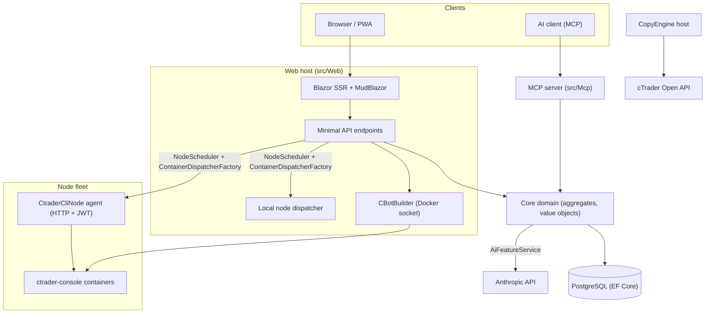

# Architecture overview

cMind — это multi-tenant **Blazor Server + Minimal API** платформа для cTrader, построенная на **.NET 10 /
C# 14**, EF Core + PostgreSQL, и .NET Aspire, с MCP сервером и AI ядром. Следует
**strict Domain-Driven Design**: бизнес-правила живут на aggregates и value objects в чистом
`Core`, а всё остальное оркестрирует.

Эта страница — карта. За *почему* за конкретными решениями — см.
[Architecture Decision Records](./adr/README.md).

## Модули

| Проект | Ответственность |
|---|---|
| `src/Core` | Чистый домен — entities, aggregates, value objects, strong IDs, domain events, Core-side interfaces. **Zero** infra dependencies (нет EF/HttpClient/Docker/ASP.NET). |
| `src/Infrastructure` | EF Core + PostgreSQL, DataProtection encryption, GHCR client, Anthropic AI client, observability. |
| `src/Nodes` | Cross-node orchestration — scheduling, dispatch, pollers, background services. |
| `src/CtraderCliNode` | Standalone HTTP node agent на удалённых хостах (JWT-auth, no shell). Запускает и бэктестит cBots через **cTrader CLI** внутри docker-контейнера. |
| `src/CopyEngine` | Copy-trading host: зеркалирует трейды с исходного счёта на назначения. |
| `src/CTraderOpenApi` | cTrader Open API client (protobuf over TCP/SSL) — auth, trading session, equity. |
| `src/Web` | Blazor Server SSR + Minimal API + SignalR + MudBlazor UI. |
| `src/Mcp` | MCP HTTP+SSE сервер, exposing tools AI-клиентам. |
| `src/AppHost` | .NET Aspire оркестратор (Postgres, Web, MCP, pgAdmin). |

## Общая картина

## Request flows

### Build & backtest

1. Пользователь отправляет cBot исходный проект. `CBotBuilder` запускается **на веб-хосте** (нужен Docker
   socket) inside a throwaway SDK container with a bind-mounted `/work` and a shared
   `app-nuget-cache` volume, so untrusted MSBuild can't reach the host filesystem or network.
2. Run/backtest контейнеры выполняются на узле, выбранном `NodeScheduler`, dispatched through
   `ContainerDispatcherFactory` → либо `Http` (удалённый `CtraderCliNode` агент) или `Local` (собственный узел веб-хоста).
3. Контейнеры запускают `ghcr.io/spotware/ctrader-console` with `--exit-on-stop`. Pollers
   (`RunCompletionPoller`, `BacktestCompletionPoller`) сверяют self-exited контейнеры: exit 0/null
   ⇒ Stopped, non-zero ⇒ Failed.

Instance state is **TPH, and a transition replaces the entity** (the discriminator can't change), so
an instance **id changes** starting → running → terminal. The **container id is stable** и carried
over; the HTTP agent keyed by container id for status/report/stop/logs.

### cTrader CLI nodes

cTrader CLI nodes get **no SSH or shell**. Main app talks to each agent over HTTP; every request
carries a short-lived HS256 **JWT** (5-minute, `iss=app-main` / `aud=app-node`) signed with that
node's secret. The agent only runs images matching `AllowedImagePrefix`, execs docker via
`ArgumentList` (never a shell), and is stateless (it finds containers by the `app.instance` label).
Agents self-register and heartbeat to `POST /api/nodes/register`; the main app upserts the
`CtraderCliNode` **by name** so it survives IP changes.

### Copy trading

`CopyEngineSupervisor` (a `BackgroundService`) reconciles running copy profiles with live
`CopyEngineHost` instances — claiming profiles via an atomic DB lease (so two nodes never
double-copy), renewing leases, and restarting dead hosts. Each `CopyEngineHost` connects to the
cTrader Open API, mirrors source executions onto destinations through the pure `CopyDecisionEngine`
(direction/latency/slippage filters + sizing), and self-heals via resync + partial-fill true-up.

### AI

AI is **fully gated on `AppOptions.Ai.ApiKey`** — unset ⇒ every feature returns `AiResult.Fail` and
the app runs unchanged (no key needed for build/test/E2E). `IAiClient` calls Anthropic over **raw
HTTP** (a typed `HttpClient`), deliberately not the SDK. `AiFeatureService` is the single
orchestrator shared by Web endpoints, the MCP `AiTools`, and `AiRiskGuard`.

## Cross-cutting rules

- **One `SaveChanges` mutates one aggregate.** Cross-aggregate flows use domain events dispatched by
  an EF interceptor.
- **Aggregates reference each other by strong ID**, never navigation property.
- **No ambient clock.** Code injects `TimeProvider`; domain methods take a `DateTimeOffset now`.
- **Secrets** are encrypted via `ISecretProtector` (`EncryptionPurposes`); **strings** live in
  `Core/Constants/`; **logs** go through source-generated `LogMessages`.

These are enforced in CI: the analyzer sweep, the zero-warning build, and
`ArchitectureGuardTests` (which fail the build on an ambient-clock read, a Core infra dependency, or
a direct `ILogger.Log*` call).
