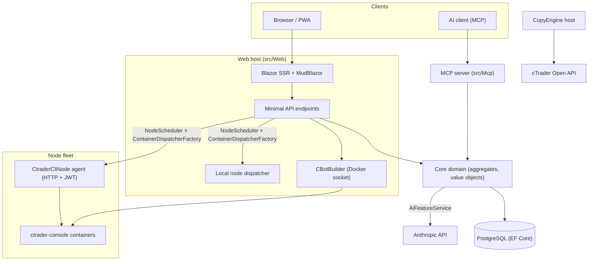

# Prehľad architektúry

cMind je multi-tenant platforma **Blazor Server + Minimal API** pre cTrader, postavená na **.NET 10 /
C# 14**, EF Core + PostgreSQL a .NET Aspire, s MCP serverom a AI jadrom. Nasleduje
**striktný Domain-Driven Design**: obchodná logika žije na agregátoch a value objektoch v čistom
`Core` a všetko ostatné orchestruje.

Táto stránka je mapa. Pre *prečo* za špecifickými rozhodnutiami pozrite
[Architecture Decision Records](./adr/README.md).

## Moduly

| Projekt | Zodpovednosť |
|---|---|
| `src/Core` | Čistá doména — entity, agregáty, value objekty, silné ID, doménové udalosti, Core-side rozhrania. **Nula** infra závislostí (žiadne EF/HttpClient/Docker/ASP.NET). |
| `src/Infrastructure` | EF Core + PostgreSQL, DataProtection šifrovanie, GHCR klient, Anthropic AI klient, pozorovateľnosť. |
| `src/Nodes` | Orchestrácia medzi uzlami — plánovanie, dispatch, pollers, background services. |
| `src/CtraderCliNode` | Samostatný HTTP node agent na vzdialených hostiteľoch (JWT-auth, bez shell). Spúšťa a backtestuje cBots riadením **cTrader CLI** vnútri docker kontajnera — a bude optimizovať aj, keď cTrader CLI to bude podporovať. |
| `src/CopyEngine` | Copy-trading host: zrkadlí obchody zo zdrojového účtu na cieľové. |
| `src/CTraderOpenApi` | cTrader Open API klient (protobuf cez TCP/SSL) — auth, trading session, equity. |
| `src/Web` | Blazor Server SSR + Minimal API + SignalR + MudBlazor UI. |
| `src/Mcp` | MCP HTTP+SSE server vystavujúci nástroje AI klientom. |
| `src/AppHost` | .NET Aspire orchestrátor (Postgres, Web, MCP, pgAdmin). |

## Veľký pohľad

## Toky požiadaviek

### Build & backtest

1. Používateľ odošle projekt zdrojového kódu cBotu. `CBotBuilder` beží **na web hoste** (potrebuje docker socket) vnútri jednorazového SDK kontajnera s bind-mounted `/work` a zdieľaným `app-nuget-cache` volumom, takže neverihodný MSBuild nemôže dosiahnuť súborový systém hostitele ani sieť.
2. Run/backtest kontajnery sa spúšťajú na uzle vybranom `NodeScheduler`, dispatchovanom cez `ContainerDispatcherFactory` → buď `Http` (vzdialený `CtraderCliNode` agent) alebo `Local` (web host vlastný node).
3. Kontajnery spúšťajú `ghcr.io/spotware/ctrader-console` s `--exit-on-stop`. Pollers (`RunCompletionPoller`, `BacktestCompletionPoller`) zosúlaďujú samorušiace sa kontajnery: exit 0/null ⇒ Stopped, non-zero ⇒ Failed.

Stav instance je **TPH, a prechod zamení entitu** (diskriminátor sa nemôže zmeniť), takže instance **id sa zmení** starting → running → terminal. **Container id je stabilný** a prenáša sa; HTTP agent je kľúčovaný podľa container id pre status/report/stop/logs.

### cTrader CLI uzly

cTrader CLI uzly nedostanú **SSH ani shell**. Hlavná aplikácia s každým agentom komunikuje cez HTTP; každá požiadavka nesie krátkoživé HS256 **JWT** (5-minút, `iss=app-main` / `aud=app-node`) podpísané tajomstvom toho uzla. Agent spúšťa iba obrazy pasujúce na `AllowedImagePrefix`, spúšťa docker cez `ArgumentList` (nikdy shell) a je stateless (nájde kontajnery podľa `app.instance` label). Agenti sa sami registrujú a heartbeat do `POST /api/nodes/register`; hlavná aplikácia upsertuje `CtraderCliNode` **podľa mena** aby to prežilo zmeny IP.

### Kopírovanie obchodov

`CopyEngineSupervisor` (a `BackgroundService`) zosúlaďuje bežiace copy profily s živými `CopyEngineHost` inštanciami — záväzujúc profily cez atomickú DB lease (takže dva uzly nikdy neduplikujú kopíu), obnovujúc leasy a reštartujúc mŕtve hostitele. Každý `CopyEngineHost` sa pripojí na cTrader Open API, zrkadlí zdrojové vykonania na ciele cez čistý `CopyDecisionEngine` (direction/latency/slippage filtre + sizing) a self-heals cez resync + partial-fill true-up.

### AI

AI je **plne bránené na `AppOptions.Ai.ApiKey`** — nenastavené ⇒ každá funkcia vracia `AiResult.Fail` a aplikácia beží bez zmeny (žiadny kľúč potrebný pre build/test/E2E). `IAiClient` volá Anthropic cez **raw HTTP** (typovaný `HttpClient`), zámerne nie SDK. `AiFeatureService` je jediný orchestrátor zdieľaný Web endpointmi, MCP `AiTools` a `AiRiskGuard`.

## Prierezové pravidlá

- **Jeden `SaveChanges` mení jeden agregát.** Toky medzi agregátmi používajú doménové udalosti dispatchované EF interceptorom.
- **Agregáty si odkazujú cez silné ID**, nikdy navigation property.
- **Bez ambient clock.** Kód injektuje `TimeProvider`; doménové metódy berú `DateTimeOffset now`.
- **Tajomstvá** sú šifrovaná cez `ISecretProtector` (`EncryptionPurposes`); **stringy** žijú v `Core/Constants/`; **logy** idú cez source-generated `LogMessages`.

Tieto sú vynucované v CI: sweep analyzátoru, zero-warning build a `ArchitectureGuardTests` (ktoré zacelia build na ambient-clock čítaní, Core infra závislosti alebo priamom `ILogger.Log*` volání).
