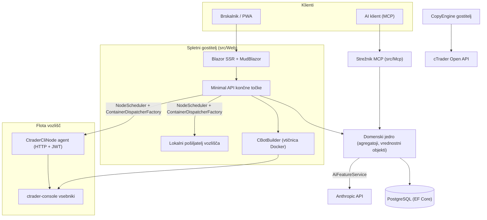

# Pregled arhitekture

cMind je več-stanovalska platforma **Blazor Server + Minimal API** za cTrader, zgrajena na **.NET 10 / C# 14**, EF Core + PostgreSQL in .NET Aspire, s strežnikom MCP in jedrom AI. Sledi **strogemu Domain-Driven Design-u**: plikovna pravila živijo na agregatorjih in vrednostnih objektih v čistem `Core`, vse ostalo pa dirigira.

Ta stran je zemljevid. Za *zakaj* za specifičnimi izbire, glejte [Architecture Decision Records](./adr/README.md).

## Moduli

| Projekt | Odgovornost |
|---|---|
| `src/Core` | Čista domena — entitete, agregatoji, vrednostni objekti, trdni IDji, domenski dogodki, vmesniki na ravni Core. **Nič** odvisnosti od infrastrukture (brez EF/HttpClient/Docker/ASP.NET). |
| `src/Infrastructure` | EF Core + PostgreSQL, šifriranje DataProtection, GHCR klient, Anthropic AI klient, opazljivost. |
| `src/Nodes` | Orkestracija med vozlišči — razporejanje, pošiljanje, ankete, storitve v ozadju. |
| `src/CtraderCliNode` | Samostojen HTTP agent vozlišča na oddaljenih gostiteljih (JWT-avtentikacija, brez lupine). Poganja in testira cBote s krmiljenjem **cTrader CLI** znotraj docker vsebnika — in bo tudi optimiziral, ko cTrader CLI to doda. |
| `src/CopyEngine` | Gostitelj kopiranja trgovanja: ogledala poslov sSourceAccount na odredišči. |
| `src/CTraderOpenApi` | Klient cTrader Open API (protobuf preko TCP/SSL) — avtentikacija, trgovalna seja, kapital. |
| `src/Web` | Blazor Server SSR + Minimal API + SignalR + MudBlazor UI. |
| `src/Mcp` | Strežnik MCP HTTP+SSE ki izpostavlja orodja AI strankam. |
| `src/AppHost` | Orkestrator .NET Aspire (Postgres, Web, MCP, pgAdmin). |

## Velika slika

## Tokovi zahtevkov

### Gradnja & backtest

1. Uporabnik pošlje izvorni projekt cBot. `CBotBuilder` teče **na spletnem gostitelju** (potrebuje Docker vtičnico) znotraj enkratnega SDK vsebnika z vezanim `/work` in skupno `app-nuget-cache` glasnostjo, tako da nespouzdani MSBuild ne more dosegati gostitelja.
2. Vsebniki za zagon/backtest se izvršijo na vozlišču, ki ga izbere `NodeScheduler`, poslani prek `ContainerDispatcherFactory` → bodisi `Http` (oddaljen agent `CtraderCliNode`) bodisi `Local` (lastno vozlišče spletnega gostitelja).
3. Vsebniki poganjajo `ghcr.io/spotware/ctrader-console` z `--exit-on-stop`. Ankete (`RunCompletionPoller`, `BacktestCompletionPoller`) usklajujejo samoizhojne vsebnika: izhod 0/null ⇒ Ustavljen, ne-nič ⇒ Napaka.

Stanje primerov je **TPH in prelaznica zamenja entiteto** (diskriminator se ne more spremeniti), tako da se ID primerov **spremeni** pričenjanje → teče → terminal. **ID vsebnika je stalen** in se nosi; HTTP agent je ključan po ID vsebnika za status/poročilo/zaustavljanje/dnevnike.

### vozlišča cTrader CLI

vozlišča cTrader CLI dobijo **ni SSH ali lupine**. Glavna aplikacija se pogovarja z vsakim agentom prek HTTP; vsak zahtevek nosi kratko-živečo HS256 **JWT** (5-minut, `iss=app-main` / `aud=app-node`) podpisano s tajno ključem vozlišča. Agent samo poganja slike, ki se ujemajo z `AllowedImagePrefix`, docker prek `ArgumentList` (nikoli lupina) in je brez stanja (najde vsebnika po oznaki `app.instance`).
Agenti se samoregistrirajo in utripajo na `POST /api/nodes/register`; glavna aplikacija upserts the `CtraderCliNode` **po imenu** da preživi spremembe IP naslovov.

### Kopiranje trgovanja

`CopyEngineSupervisor` (a `BackgroundService`) usklajuje profilov s tekočimi primerome `CopyEngineHost` — trditve profili prek atomske DB zakupa (tako da dva vozlišča nikoli ne kopiras dvakrat), obnovljive zakupe in restartaj mrtve gostiteljce. Vsak `CopyEngineHost` se poveže na cTrader Open API, ogledala izvedbe vira na odredišča prek čistega `CopyDecisionEngine` (smerokazi/zakasnitev/drsni filtri + volumna), in se sam zdravi prek resync + delne zapolnitve.

### AI

AI je **popolnoma zaporedkan na `AppOptions.Ai.ApiKey`** — nenastavljen ⇒ vsaka funkcionalnost vrne `AiResult.Fail` in aplikacija teče nespremenjena (noben ključ ni potreben za gradnjo/test/E2E). `IAiClient` klice Anthropic prek **surovega HTTP** (tipiziran `HttpClient`), namerno ne SDK-ja. `AiFeatureService` je edina orkestrator deljene z Web končnimi točkami, MCP `AiTools` in `AiRiskGuard`.

## Prečne predpise

- **Ena `SaveChanges` mutira en agregat.** Tokovi med agregatoji uporabljajo domenskih dogodkov, poslanih prek EF presretnika.
- **agregatoji se nanašajo s trdnimi IDji**, nikoli lastnosti za navigacijo.
- **Ni okoljske ure.** Koda injicira `TimeProvider`; domenski metodi sprejmejo `DateTimeOffset now`.
- **Skrivnosti** so šifrirane prek `ISecretProtector` (`EncryptionPurposes`); **nizi** živijo v `Core/Constants/`; **dnevniki** gredo prek izvora-generiranega `LogMessages`.

Te so uveljavljene v CI: analizator je obmetaval, nič-opozarjal gradnjo in `ArchitectureGuardTests` (ki ne uspe na okoljski uri, odvisnosti infrastrukture Core ali direkten `ILogger.Log*` klic).
