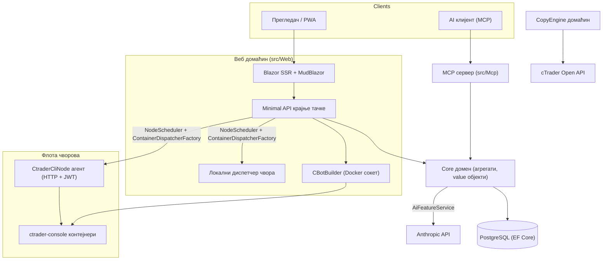

# Преглед архитектуре

cMind је платформа за вишестране кориснике **Blazor Server + Minimal API** за cTrader, саграђена на **.NET 10 /
C# 14**, EF Core + PostgreSQL, и .NET Aspire, са MCP сервером и AI језгром. Она следи
**строгу Domain-Driven Design**: пословна правила живе на агрегатима и value објектима у чистом
`Core`, и све остало организује.

Ова страница је мапа. За *зашто* иза специфичних избора, видите
[Записи архитектурских одлука](./adr/README.md).

## Модули

| Пројекат | Одговорност |
|---|---|
| `src/Core` | Чист домен — јединице, агрегати, value објекти, јаки ID-и, доменски догађаји, Core интерфејси. **Нула** инфра зависности (без EF/HttpClient/Docker/ASP.NET). |
| `src/Infrastructure` | EF Core + PostgreSQL, DataProtection енкрипција, GHCR клијент, Anthropic AI клијент, запажљивост. |
| `src/Nodes` | Координирање кроз чворове — планирање, слање, полери, позадински сервиси. |
| `src/CtraderCliNode` | Самостални HTTP агент чвора на удаљеним домаћинима (JWT-проверка, без shell-а). Покреће и тестира cBots вожењем **cTrader CLI** унутар docker контејнера — и оптимизоваће такође, чим cTrader CLI то дода. |
| `src/CopyEngine` | Домаћин за копирање трговања: огледа трговину из изворног налога на одредишта. |
| `src/CTraderOpenApi` | cTrader Open API клијент (protobuf преко TCP/SSL) — проверка, трговачка сеанса, акције. |
| `src/Web` | Blazor Server SSR + Minimal API + SignalR + MudBlazor UI. |
| `src/Mcp` | MCP HTTP+SSE сервер експонирајући алате AI клијентима. |
| `src/AppHost` | .NET Aspire оркестратор (Postgres, Web, MCP, pgAdmin). |

## Велика слика

## Токови захтева

### Грађење & тестирање

1. Корисник предаје cBot изворни пројекат. `CBotBuilder` се покреће **на веб домаћину** (потребан је Docker
   сокет) унутар прилично SDK контејнера са монтираним `/work` и дељеном
   `app-nuget-cache` јачином, тако неповерљив MSBuild не може достићи филесистем или мрежу домаћина.
2. Покрени/тестирани контејнери се извршавају на чвору који је одабрао `NodeScheduler`, послан кроз
   `ContainerDispatcherFactory` → или `Http` (удаљени `CtraderCliNode` агент) или `Local` (веб
   домаћин властити чвор).
3. Контејнери покрећу `ghcr.io/spotware/ctrader-console` са `--exit-on-stop`. Полери
   (`RunCompletionPoller`, `BacktestCompletionPoller`) помире контејнере који сами изађу: излаз 0/нула
   ⇒ Заустављено, не-нула ⇒ Неуспешно.

Стање инстанце је **TPH, и транзиција замењује јединицу** (дискриминатор не може се променити), тако
инстанца **ID се мења** почињу → трче → терминал. **ID контејнера је стабилан** и преноси се; HTTP агент је кључан по ID контејнера за статус/извештај/заустављање/логове.

### cTrader CLI чворови

cTrader CLI чворови **немају SSH или shell**. Главна апликација разговара са сваким агентом преко HTTP; сваки захтев
носи краткотрајни HS256 **JWT** (5-минутни, `iss=app-main` / `aud=app-node`) потписан са том
тајном чвора. Агент само покреће слике које се подударају са `AllowedImagePrefix`, извршава docker преко
`ArgumentList` (никад не користи shell), и је без стања (налази контејнере по ознаци `app.instance`).
Агенти се самостално региструју и упаљају `POST /api/nodes/register`; главна апликација ажурира
`CtraderCliNode` **по имену** тако преживи IP промене.

### Копирање трговања

`CopyEngineSupervisor` (a `BackgroundService`) помира редовне профиле копирања са живим
`CopyEngineHost` инстанцама — захватајући профиле преко атомске DB лизинга (тако два чвора никад
двоструко копирају), обнављају лизингу, и рестартају мрве домаћине. Свака `CopyEngineHost` се повезује са
cTrader Open API, огледа изворне извршавању на одредишта кроз чист `CopyDecisionEngine`
(смер/кашњење/скорњаж филтри + величина), и сама се лечи кроз повторну синхронизацију + делимична-полна исправка.

### AI

AI је **потпуно закупљена на `AppOptions.Ai.ApiKey`** — неусловљена ⇒ свака функција враћа `AiResult.Fail` и
апликација ради непромењена (кључ није потребан за грађење/тестирање/E2E). `IAiClient` позива Anthropic преко **сировог
HTTP** (типизирани `HttpClient`), намерно не SDK. `AiFeatureService` је јединствени
оркестратор дељен од Web крајњих тачака, MCP `AiTools`, и `AiRiskGuard`.

## Правила кроз све

- **Један `SaveChanges` мутира један агрегат.** Токови између агрегата користе доменске догађаје послане од
  EF перехвача.
- **Агрегати се референцирају једни друге преко јаког ID-а**, никад навигационог својства.
- **Нема амбијентног сата.** Код инјектира `TimeProvider`; доменске методе узимају `DateTimeOffset now`.
- **Тајне** су енкриптоване преко `ISecretProtector` (`EncryptionPurposes`); **стројеви** живе у
  `Core/Constants/`; **логови** иду кроз генерисане `LogMessages`.

Ова су примењена у CI: анализа за метлу, нула-упозорење грађење, и
`ArchitectureGuardTests` (која неуспешна при грађењу амбијентног сата читања, Core инфра зависности, или
директном `ILogger.Log*` позову).
