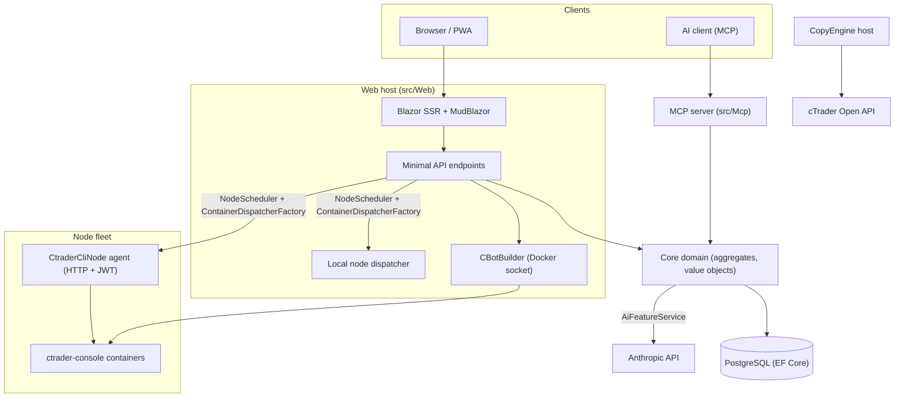

# Architecture overview

cMind เป็น multi-tenant **Blazor Server + Minimal API** platform สำหรับ cTrader สร้างบน **.NET 10 / C# 14** EF Core + PostgreSQL และ .NET Aspire ด้วย MCP server และ AI core มันปฏิบัติตาม **strict Domain-Driven Design**: business rules อยู่บน aggregates และ value objects ใน pure `Core` และ everything else orchestrates

หน้านี้เป็นแผนที่ สำหรับ *why* ด้านหลัง choices เฉพาะ ดู [Architecture Decision Records](./adr/README.md)

## Modules

| Project | Responsibility |
|---|---|
| `src/Core` | Pure domain — entities aggregates value objects strong IDs domain events Core-side interfaces **Zero** infra dependencies (no EF/HttpClient/Docker/ASP.NET) |
| `src/Infrastructure` | EF Core + PostgreSQL DataProtection encryption GHCR client Anthropic AI client observability |
| `src/Nodes` | Cross-node orchestration — scheduling dispatch pollers background services |
| `src/CtraderCliNode` | Standalone HTTP node agent บน remote hosts (JWT-auth ไม่มี shell) Runs และ backtests cBots โดยขับเคลื่อน **cTrader CLI** ภายใน docker container — และ optimize ด้วย เมื่อ cTrader CLI เพิ่มมัน |
| `src/CopyEngine` | copy-trading host: mirrors trades from source account ไปยัง destinations |
| `src/CTraderOpenApi` | cTrader Open API client (protobuf over TCP/SSL) — auth trading session equity |
| `src/Web` | Blazor Server SSR + Minimal API + SignalR + MudBlazor UI |
| `src/Mcp` | MCP HTTP+SSE server exposing tools to AI clients |
| `src/AppHost` | .NET Aspire orchestrator (Postgres Web MCP pgAdmin) |

## The big picture

## Request flows

### Build & backtest

1. user ส่ง cBot source project `CBotBuilder` วิ่ง **บน web host** (มันต้อง Docker socket) ภายใน throwaway SDK container ด้วย bind-mounted `/work` และ shared `app-nuget-cache` volume ดังนั้น untrusted MSBuild ไม่สามารถ reach host filesystem หรือ network
2. Run/backtest containers execute บน node เลือก `NodeScheduler` dispatched ผ่าน `ContainerDispatcherFactory` → either `Http` (remote `CtraderCliNode` agent) หรือ `Local` (web host ของเขาเอง node)
3. Containers run `ghcr.io/spotware/ctrader-console` ด้วย `--exit-on-stop` Pollers (`RunCompletionPoller` `BacktestCompletionPoller`) reconcile self-exited containers: exit 0/null ⇒ Stopped non-zero ⇒ Failed

Instance state เป็น **TPH และ transition replaces entity** (discriminator ไม่สามารถเปลี่ยน) ดังนั้น instance **id เปลี่ยน** starting → running → terminal **container id เสถียร** และ carried over; HTTP agent keyed โดย container id สำหรับ status/report/stop/logs

### cTrader CLI nodes

cTrader CLI nodes ได้ **no SSH หรือ shell** main app พูดเป็น agent แต่ละอันบน HTTP; request ทุกอัน carries short-lived HS256 **JWT** (5-minute `iss=app-main` / `aud=app-node`) ลงนาม ด้วย node secret นั่น agent วิ่ง images เพียง matching `AllowedImagePrefix` execs docker ผ่าน `ArgumentList` (ไม่เคย shell) และ stateless (มันพบ containers โดย `app.instance` label) Agents self-register และ heartbeat เป็น `POST /api/nodes/register`; main app upserts `CtraderCliNode` **โดยชื่อ** ดังนั้นมันรอด IP เปลี่ยน

### Copy trading

`CopyEngineSupervisor` (a `BackgroundService`) reconciles running copy profiles ด้วย live `CopyEngineHost` instances — claiming profiles ผ่าน atomic DB lease (ดังนั้นสองโหนดไม่เคย double-copy) renewing leases และ restarting dead hosts แต่ละ `CopyEngineHost` เชื่อมต่อ cTrader Open API mirrors source executions ไปยัง destinations ผ่าน pure `CopyDecisionEngine` (direction/latency/slippage filters + sizing) และ self-heals ผ่าน resync + partial-fill true-up

### AI

AI เป็น **fully gated บน `AppOptions.Ai.ApiKey`** — unset ⇒ feature ทุกอัน ส่งกลับ `AiResult.Fail` และ app วิ่ง unchanged (ไม่มี key ต้อง build/test/E2E) `IAiClient` เรียก Anthropic บน **raw HTTP** (typed `HttpClient`) deliberately ไม่มี SDK `AiFeatureService` เป็น orchestrator เดียว shared โดย Web endpoints MCP `AiTools` และ `AiRiskGuard`

## Cross-cutting rules

- **One `SaveChanges` mutates one aggregate** Cross-aggregate flows ใช้ domain events dispatched โดย EF interceptor
- **Aggregates reference กัน โดย strong ID** ไม่เคย navigation property
- **No ambient clock** Code injects `TimeProvider`; domain methods เอา `DateTimeOffset now`
- **Secrets** เข้ารหัส ผ่าน `ISecretProtector` (`EncryptionPurposes`); **strings** อยู่ใน `Core/Constants/`; **logs** ผ่าน source-generated `LogMessages`

เหล่านี้บังคับบน CI: analyzer sweep zero-warning build และ `ArchitectureGuardTests` (ซึ่งล้มเหลว build บน ambient-clock อ่าน Core infra dependency หรือ direct `ILogger.Log*` เรียก)
