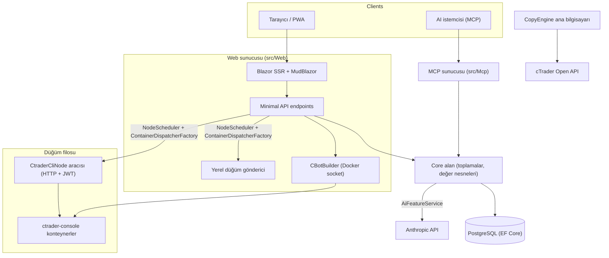

# Mimari genel bakış

cMind, **.NET 10 / C# 14** üzerinde inşa edilmiş, cTrader için çok kiracılı bir **Blazor Server + Minimal API**
platformudur; EF Core + PostgreSQL, .NET Aspire, bir MCP sunucusu ve bir AI çekirdeği ile. **Katı Alan Odaklı
Tasarım** izler: iş kuralları saf `Core`'da toplama ve değer nesneleri üzerinde yaşar ve diğer her şey düzenler.

Bu sayfa harita. Belirli seçimlerin *neden* oluşturulduğu için, bkz.
[Mimari Karar Kayıtları](./adr/README.md).

## Modüller

| Proje | Sorumluluk |
|---|---|
| `src/Core` | Saf alan — varlıklar, toplamalar, değer nesneleri, güçlü ID'ler, alan olayları, Core tarafı arabirimler. **Sıfır** altyapı bağımlılıkları (EF/HttpClient/Docker/ASP.NET yok). |
| `src/Infrastructure` | EF Core + PostgreSQL, DataProtection şifrelemesi, GHCR istemcisi, Anthropic AI istemcisi, gözlemlenebilirlik. |
| `src/Nodes` | Düğümler arası düzenleme — planlama, gönderme, yoklamacılar, arka plan hizmetleri. |
| `src/CtraderCliNode` | Uzak ana bilgisayarlarda bağımsız HTTP düğüm aracısı (JWT-auth, kabuk yok). **cTrader CLI**'yi bir docker konteynerinin içinde çalıştırarak cBot'ları çalıştırır ve backtestler — ve cTrader CLI bunu ekledikten sonra optimize de yapacaktır. |
| `src/CopyEngine` | Kopya ticaret ana bilgisayarı: bir kaynak hesaptan hedef hesaplara işlemleri yansıtır. |
| `src/CTraderOpenApi` | cTrader Open API istemcisi (protobuf TCP/SSL üzerinden) — kimlik doğrulama, ticaret oturumu, öz sermaye. |
| `src/Web` | Blazor Server SSR + Minimal API + SignalR + MudBlazor UI. |
| `src/Mcp` | AI istemcilerine araçlar sunan MCP HTTP+SSE sunucusu. |
| `src/AppHost` | .NET Aspire düzenleyicisi (Postgres, Web, MCP, pgAdmin). |

## Büyük resim

## İstek akışları

### Derleme ve backtest

1. Bir kullanıcı bir cBot kaynak projesi gönderir. `CBotBuilder` web sunucusunda çalışır (Docker
   soketine ihtiyaç duyar), bağlama monte edilmiş `/work` ve paylaşılan
   `app-nuget-cache` ses seviyesi ile tek seferlik SDK konteynerinin içinde, güvenilmeyen MSBuild ana bilgisayar
   dosya sistemi veya ağına ulaşamaz.
2. Çalıştırma/backtest konteynerler `NodeScheduler` tarafından seçilen bir düğümde yürütülür,
   `ContainerDispatcherFactory` → ya `Http` (uzak bir `CtraderCliNode` aracısı) ya da `Local` (web
   sunucusunun kendi düğümü) aracılığıyla gönderilir.
3. Konteynerler `ghcr.io/spotware/ctrader-console`'u `--exit-on-stop` ile çalıştırır. Yoklamacılar
   (`RunCompletionPoller`, `BacktestCompletionPoller`) kendi kendine çıkan konteynerler ile uzlaşırlar: çıkış 0/null
   ⇒ Durduruldu, sıfır olmayan ⇒ Başarısız.

Örnek durum **TPH'dir ve bir geçiş varlığı değiştirir** (ayrıştırıcı değişemez), bu nedenle
bir örnek **id değişiklikleri** başlangıç → çalıştırılıyor → terminal. **Konteyner kimliği kararlıdır** ve taşınır;
HTTP aracısı, durum/rapor/durdur/günlükler için konteyner kimliği tarafından anahtarlanır.

### cTrader CLI düğümleri

cTrader CLI düğümleri **SSH veya kabuk almaz**. Ana uygulama her aracı ile HTTP üzerinden konuşur; her istek
kısa ömürlü bir HS256 **JWT** taşır (5 dakika, `iss=app-main` / `aud=app-node`) o
düğümün sırrı ile imzalanmış. Aracı sadece `AllowedImagePrefix` ile eşleşen görüntüleri çalıştırır, `ArgumentList` via
docker exec'i (hiçbir zaman bir kabuk) ve durumsuz (`app.instance` etiketi tarafından konteynerler bulur).
Aracılar kendi kendini kaydeder ve `POST /api/nodes/register` 'e kalp atışı yapar; ana uygulama
`CtraderCliNode` **adına göre** upsert yapar, bu da IP değişikliklerinden sağ kalır.

### Kopya ticareti

`CopyEngineSupervisor` (bir `BackgroundService`) çalışan kopya profilleri canlı
`CopyEngineHost` örnekleri ile uzlaşırlar — atomik bir DB kirasıyla profilleri talep ederler (bu nedenle iki düğüm
hiçbir zaman çift kopya yapmaz), kiraları yenilerler ve ölü ana bilgisayarları yeniden başlatırlar. Her `CopyEngineHost`
cTrader Open API'ye bağlanır, kaynak yürütmeleri saf `CopyDecisionEngine` aracılığıyla hedeflere yansıtır
(yön/gecikme/kayan filtreler + boyutlandırma) ve resync + kısmi doldurma true-up aracılığıyla kendi kendini iyileştirir.

### AI

AI **`AppOptions.Ai.ApiKey` 'de tamamen kapılandırılır** — ayarlı değil ⇒ her özellik `AiResult.Fail` döndürür ve
uygulama değişmeden çalışır (derleme/test/E2E için anahtar gerekmez). `IAiClient` Anthropic'i **raw
HTTP** (bir türü `HttpClient`) aracılığıyla çağırır, kasıtlı olarak SDK'yı değil. `AiFeatureService` tek
orkestratördür, Web endpoints, MCP `AiTools` ve `AiRiskGuard` tarafından paylaşılan.

## Kesişen kurallar

- **Bir `SaveChanges` bir toplamayı değiştirir.** Çapraz toplama akışları bir EF ara katmanı tarafından
  gönderilen alan olaylarını kullanır.
- **Toplamalar birbirini güçlü ID ile referans alırlar**, asla navigasyon özelliği.
- **Ortam saati yok.** Kod `TimeProvider` enjekte eder; alan yöntemleri bir `DateTimeOffset now` alır.
- **Sırlar** `ISecretProtector` (`EncryptionPurposes`) aracılığıyla şifrelenir; **dizeler**
  `Core/Constants/` içinde yaşar; **günlükler** kaynak tarafından üretilen `LogMessages` aracılığıyla gider.

Bunlar CI'da uygulanır: analizör taraması, sıfır uyarı derlemesi ve
`ArchitectureGuardTests` (ortam saati okuması, Core altyapı bağımlılığı veya
doğrudan `ILogger.Log*` çağrısı üzerinde derlemeyi başarısız kılar).
