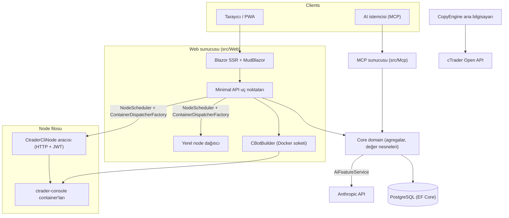

# Mimariye Genel Bakış

cMind, **.NET 10 / C# 14**, EF Core + PostgreSQL ve .NET Aspire üzerine inşa edilmiş, bir MCP sunucusu ve bir AI çekirdeği ile birlikte cTrader için çok kiracılı **Blazor Server + Minimal API** platformudur. **Sıkı Domain-Driven Design**'ı takip eder: iş kuralları saf bir `Core`'daki agregalar ve değer nesneleri üzerinde yaşar ve geri kalan her şey orkestre eder.

Bu sayfa haradır. Belirli seçimlerin *nedeni* için bkz. [Mimari Karar Kayıtları](./adr/README.md).

## Modüller

| Proje | Sorumluluk |
|---|---|
| `src/Core` | Saf domain — varlıklar, agregalar, değer nesneleri, güçlü ID'ler, domain olayları, Core tarafı arayüzleri. **Sıfır** altyapı bağımlılığı (EF/HttpClient/Docker/ASP.NET yok). |
| `src/Infrastructure` | EF Core + PostgreSQL, DataProtection şifreleme, GHCR istemcisi, Anthropic AI istemcisi, gözlemlenebilirlik. |
| `src/Nodes` | Çapraz-node orkestrasyon — planlama, dağıtım, yoklayıcılar, arka plan hizmetleri. |
| `src/CtraderCliNode` | Uzak ana bilgisayarlarda (JWT kimlik doğrulama, shell yok) çalışan bağımsız HTTP node aracısı. **cTrader CLI**'yi docker container içinde çalıştırarak cBot'ları çalıştırır ve backtest yapar — cTrader CLI eklendiğinde optimize de yapacak. |
| `src/CopyEngine` | Kopyalama-ticaret ana bilgisayarı: kaynak hesabındaki işlemleri hedeflere yansıtır. |
| `src/CTraderOpenApi` | cTrader Open API istemcisi (TCP/SSL üzerinden protobuf) — kimlik doğrulama, ticaret oturumu, equity. |
| `src/Web` | Blazor Server SSR + Minimal API + SignalR + MudBlazor UI. |
| `src/Mcp` | AI istemcilerine araçları ifşa eden MCP HTTP+SSE sunucusu. |
| `src/AppHost` | .NET Aspire orkestratörü (Postgres, Web, MCP, pgAdmin). |

## Büyük Resim

## İstek Akışları

### Derleme & Backtest

1. Bir kullanıcı bir cBot kaynak projesi gönderir. `CBotBuilder` **web sunucusunda** çalışır (Docker soketine ihtiyaç duyar) ve güvenilmeyen MSBuild'in ana bilgisayarın dosya sistemine veya ağına ulaşamaması için bağlı bir `/work` ve paylaşılan bir `app-nuget-cache` volume ile bir SDK container içinde çalışır.
2. Çalıştırma/backtest container'ları `NodeScheduler` tarafından seçilen bir node üzerinde çalışır, `ContainerDispatcherFactory` üzerinden dağıtılır — ya `Http` (uzak bir `CtraderCliNode` aracısı) ya da `Local` (web sunucusunun kendi node'u).
3. Container'lar `--exit-on-stop` ile `ghcr.io/spotware/ctrader-console` çalıştırır. Yoklayıcılar (`RunCompletionPoller`, `BacktestCompletionPoller`) kendiliğinden çıkan container'ları uzlaştırır: exit 0/null ⇒ Stopped, sıfır olmayan ⇒ Failed.

Instance durumu **TPH'dir ve bir geçiş varlığı değiştirir** (diskriminatör değişemez), dolayısıyla bir instance **kimliği** başlatma → çalışma → terminal arasında değişir. **Container kimliği sabit kalır** ve taşınır; HTTP aracısı durum/sayaç/durdurma/günlükler için container kimliğine göre anahtarlanır.

### cTrader CLI Node'ları

cTrader CLI node'ları **SSH veya shell almaz**. Ana uygulama her aracıya HTTP üzerinden konuşur; her istek kısa ömürlü bir HS256 **JWT** taşır (5 dakika, `iss=app-main` / `aud=app-node`) o node'un gizliliğiyle imzalanmış. Aracı yalnızca `AllowedImagePrefix` ile eşleşen görüntüleri çalıştırır, docker'ı `ArgumentList` üzerinden çalıştırır (asla shell yok) ve durumsuzdur (container'ları `app.instance` etiketiyle bulur). Aracılar `POST /api/nodes/register`'a kendilerini kaydeder ve kalp atışı gönderir; ana uygulama IP değişikliklerinden sağ kalması için `CtraderCliNode`'u **isimle** upsert eder.

### Kopyalama Ticareti

`CopyEngineSupervisor` (bir `BackgroundService`) çalışan kopya profillerini canlı `CopyEngineHost` örnekleriyle uzlaştırır — profilleri atomik bir DB kiralama yoluyla talep eder (iki node asla aynı anda kopyalamaz), kiralamaları yeniler ve ölü ana bilgisayarları yeniden başlatır. Her `CopyEngineHost` cTrader Open API'ye bağlanır, kaynak yürütmelerini saf `CopyDecisionEngine` üzerinden hedeflere yansıtır (yön/latency/slippage filtreleri + boyutlandırma) ve resync + kısmi-doldurma true-up ile kendi kendini iyileştirir.

### AI

AI **`AppOptions.Ai.ApiKey`'e tamamen bağlıdır** — ayarlanmamışsa ⇒ her özellik `AiResult.Fail` döndürür ve uygulama değişmeden çalışmaya devam eder (derleme/test/E2E için anahtar gerekmez). `IAiClient` **ham HTTP** üzerinden (yazılan bir `HttpClient`) Anthropic'i çağırır, kasıtlı olarak SDK değil. `AiFeatureService`, Web uç noktaları, MCP `AiTools` ve `AiRiskGuard` arasında paylaşılan tek orkestratördür.

## Çapraz Kesen Kurallar

- **Bir `SaveChanges` bir agregayı değiştirir.** Çapraz-agregat akışları bir EF interceptor tarafından gönderilen domain olaylarını kullanır.
- **Agregalar birbirini güçlü ID ile referans eder**, asla navigasyon özelliği değil.
- **Ortam saati yoktur.** Kod `TimeProvider` enjekte eder; domain metotları bir `DateTimeOffset now` parametresi alır.
- **Gizlilikler** `ISecretProtector` üzerinden şifrelenir (`EncryptionPurposes`); **dizeler** `Core/Constants/` içinde yaşar; **günlükler** kaynak üretilen `LogMessages` üzerinden gider.

Bunlar CI'da uygulanır: analizör taraması, sıfır uyarı derlemesi ve bir ortam saati okuması, bir Core altyapı bağımlılığı veya doğrudan bir `ILogger.Log*` çağrısı üzerinde derlemenin başarısız olduğu `ArchitectureGuardTests`.
