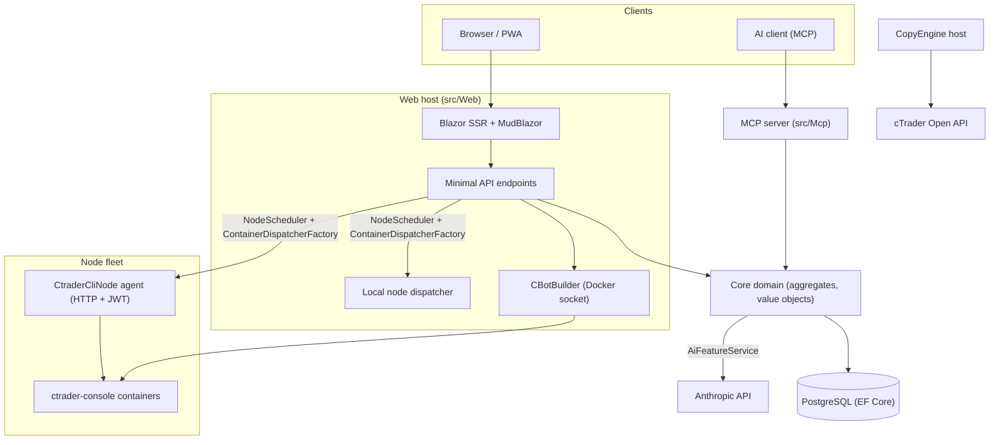

# Tổng quan kiến trúc

cMind là một nền tảng **Blazor Server + Minimal API** đa thuê bao cho cTrader, được xây dựng trên **.NET 10 /
C# 14**, EF Core + PostgreSQL và .NET Aspire, với máy chủ MCP và lõi AI. Nó tuân theo
**Thiết kế Hướng Miền Nghiêm Ngặt**: các quy tắc kinh doanh sống trên các tổng thể và các đối tượng giá trị trong một
`Core` và tất cả mọi thứ khác điều phối.

Trang này là bản đồ. Đối với *lý do* đằng sau các lựa chọn cụ thể, hãy xem
[Bản ghi Quyết định Kiến trúc](./adr/README.md).

## Các mô-đun

| Dự án | Trách nhiệm |
|---|---|
| `src/Core` | Miền thuần - thực thể, tổng thể, đối tượng giá trị, ID mạnh, sự kiện miền, giao diện bên Core. **Không có** phụ thuộc cơ sở hạ tầng (không EF/HttpClient/Docker/ASP.NET). |
| `src/Infrastructure` | EF Core + PostgreSQL, mã hóa DataProtection, máy khách GHCR, máy khách Anthropic AI, khả năng quan sát. |
| `src/Nodes` | Điều phối giữa các nút — lập lịch, gửi đi, pollers, dịch vụ nền. |
| `src/CtraderCliNode` | Đại lý nút HTTP độc lập trên các máy chủ từ xa (xác thực JWT, không shell). Chạy và backtests cBots bằng cách điều khiển **CLI cTrader** bên trong một vùng chứa docker — và sẽ tối ưu hóa quá, khi CLI cTrader thêm nó. |
| `src/CopyEngine` | Máy chủ sao chép giao dịch: phản chiếu các giao dịch từ tài khoản nguồn vào các điểm đích. |
| `src/CTraderOpenApi` | Máy khách Open API cTrader (protobuf trên TCP/SSL) — xác thực, phiên giao dịch, vốn. |
| `src/Web` | Blazor Server SSR + Minimal API + SignalR + MudBlazor UI. |
| `src/Mcp` | Máy chủ MCP HTTP+SSE công khai các công cụ cho các máy khách AI. |
| `src/AppHost` | Máy nước cấp .NET Aspire (Postgres, Web, MCP, pgAdmin). |

## Bức tranh lớn

## Dòng yêu cầu

### Xây dựng & Backtest

1. Người dùng gửi một dự án nguồn cBot. `CBotBuilder` chạy **trên web host** (nó cần ổ cắm Docker) bên trong một vùng chứa SDK có thể loại bỏ với một `/work` được gắn kết và một
   `app-nuget-cache` được chia sẻ, vì vậy MSBuild không đáng tin cậy không thể truy cập hệ thống tệp máy chủ hoặc mạng.
2. Chạy các vùng chứa backtest thực thi trên một nút được chọn bởi `NodeScheduler`, được gửi qua
   `ContainerDispatcherFactory` → `Http` (một đại lý `CtraderCliNode` từ xa) hoặc `Local` (nút riêng của web host).
3. Các vùng chứa chạy `ghcr.io/spotware/ctrader-console` với `--exit-on-stop`. Pollers
   (`RunCompletionPoller`, `BacktestCompletionPoller`) hòa giải các vùng chứa thoát khỏi: thoát 0/null
   ⇒ Dừng lại, khác không ⇒ Không thành công.

Trạng thái Thực thể là **TPH và một quá trình chuyển thay thế thực thể** (bộ phân loại không thể thay đổi), vì vậy
một thực thể **id thay đổi** bắt đầu → chạy → cuối cùng. **Mã vùng chứa ổn định** và được mang
đi; đại lý HTTP được khóa bằng mã vùng chứa để trạng thái/báo cáo/dừng/nhật ký.

### Các nút CLI cTrader

Các nút CLI cTrader được **không SSH hoặc shell**. Ứng dụng chính nói chuyện với mỗi đại lý qua HTTP; mỗi yêu cầu
mang một HS256 **JWT** có tuổi thọ ngắn (5 phút, `iss=app-main` / `aud=app-node`) được ký bằng
bí mật của nút đó. Đại lý chỉ chạy các hình ảnh phù hợp với `AllowedImagePrefix`, thực thi docker qua
`ArgumentList` (không bao giờ một shell) và là tính năng không trạng thái (nó tìm thấy các vùng chứa bằng nhãn `app.instance`).
Đại lý tự đăng ký và nhịp tim để `POST /api/nodes/register`; ứng dụng chính upsert
`CtraderCliNode` **theo tên** để nó sống sót những thay đổi IP.

### Sao chép giao dịch

`CopyEngineSupervisor` (một `BackgroundService`) hòa giải các hồ sơ sao chép chạy với các thực thể `CopyEngineHost` trực tiếp
— yêu cầu hồ sơ qua một khoá DB nguyên tử (vì vậy hai nút không bao giờ giao dịch kép), gia hạn khoá và khởi động lại các máy chủ chết. Mỗi `CopyEngineHost` kết nối với
cTrader Open API, phản chiếu các thực thi nguồn vào các điểm đích thông qua `CopyDecisionEngine` thuần (hướng/độ trễ/bộ lọc trượt + kích thước) và tự chữa qua resync + true-up chia một phần.

### AI

AI được **hoàn toàn gated trên `AppOptions.Ai.ApiKey`** — không set ⇒ mọi tính năng trả về `AiResult.Fail` và
ứng dụng chạy không thay đổi (không cần khóa cho build/test/E2E). `IAiClient` gọi Anthropic trên **HTTP thô**
(một `HttpClient` được gõ), cố ý không phải SDK. `AiFeatureService` là đơn vị
điều phối được chia sẻ bởi các điểm cuối Web, `AiTools` MCP và `AiRiskGuard`.

## Quy tắc xuyên suốt

- **Một `SaveChanges` đột biến một tổng thể.** Các luồng giữa các tổng thể sử dụng sự kiện miền được gửi đi bởi
  một máy chặn EF.
- **Các tổng thể tham chiếu lẫn nhau theo ID mạnh**, không bao giờ là tính chất điều hướng.
- **Không có đồng hồ xung quanh.** Mã tiêm `TimeProvider`; các phương thức miền lấy `DateTimeOffset now`.
- **Secrets** được mã hóa qua `ISecretProtector` (`EncryptionPurposes`); **strings** sống trong
  `Core/Constants/`; **logs** đi qua `LogMessages` được tạo nguồn.

Những yếu tố này được thực thi trong CI: quét phân tích, xây dựng không cảnh báo và
`ArchitectureGuardTests` (không thành công khi đọc đồng hồ xung quanh, phụ thuộc cơ sở hạ tầng Core hoặc
một cuộc gọi `ILogger.Log*` trực tiếp).
